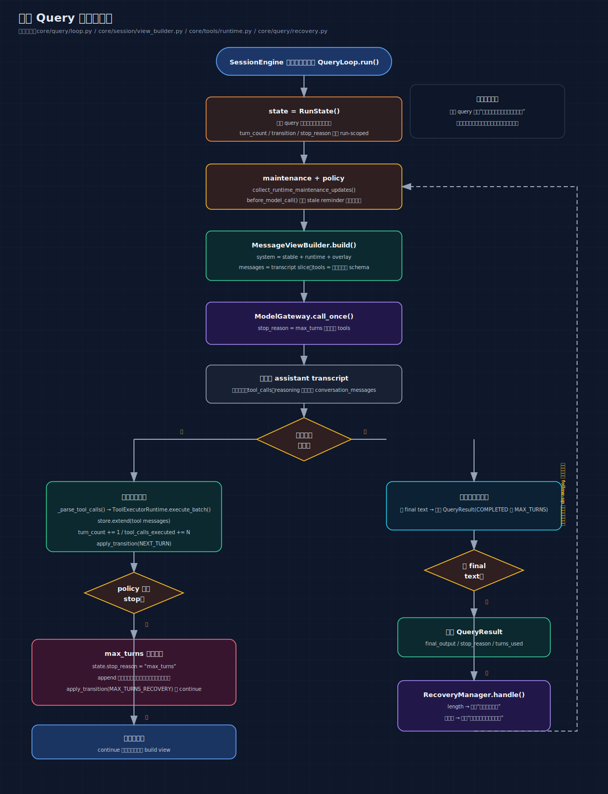

# 01: Agent Loop — AI 的思考-行动循环

> 如果只读一篇，读这篇。Agent Loop 是整个系统的骨架，其他所有功能都挂在它上面。

---

## 你将理解什么

读完这篇，你会知道：

1. 为什么 ChatGPT 不只是一个"问答机器"，而是一个能**连续思考、连续行动**的循环系统
2. 这个循环的每一步具体在做什么
3. 循环怎么开始、怎么推进、怎么结束
4. 如果出了问题（模型不回答、执行太多轮）怎么处理

**不需要任何 AI 背景。** 我会用大量例子来讲。

---

## 第一个问题：ChatGPT 是一次性回答的吗？

很多人以为 ChatGPT 是这样的：

```text
你提问 → AI 一次性给出完整答案
```

对于简单问题（"法国首都是哪"），确实如此。

但如果你说"帮我分析一下 sales.csv，生成报告"，实际发生的事是这样的：

```text
你： "帮我分析 sales.csv"

AI 想了想：
  "我需要先看看这个文件长什么样"
  → 调用 read_file 工具，读取 sales.csv

AI 看了文件内容，又想了想：
  "数据有 5000 行，我先用 Python 处理一下"
  → 调用 bash 工具，执行 python analyze.py

AI 看了脚本输出，又想了想：
  "好，分析完了，现在生成报告"
  → 调用 write_file 工具，写入 report.md

AI：
  "报告已经生成在 report.md 里了，包含：
   - 销售趋势：Q1 上升 15%，Q2 下降 8%
   - Top 5 客户：...
   - 建议：..."
  → 给出最终文字回复
```

注意这个过程的特点：

- AI 不是一次就把所有事做完的
- 每一步之后都要**重新思考**下一步该做什么
- 有些步骤是"思考"（生成文字），有些步骤是"行动"（调用工具）
- 最终会有一个"我完成了"的时刻

**Agent Loop 就是把这个过程用代码实现出来的循环。**

---

## 用代码来说：最简版本

如果只保留最核心的逻辑，Agent Loop 大概长这样：

```python
while True:
    # 把对话历史发给大模型
    response = call_model(messages)

    if response.has_tool_calls:
        # 模型说"我要调用工具"
        tool_results = execute_tools(response.tool_calls)
        messages.append(tool_results)  # 把结果加到对话历史
        continue                       # 回到循环开头，让模型看结果再想

    if response.has_text:
        # 模型给出了文字回复，没有要调工具
        return response.text           # 循环结束，把回复给用户
```

这就是一个"想一步、做一步、再想"的循环。但真正的实现要复杂得多，因为要处理很多边界情况。

---

## 概念地图

在深入之前，先建立全局观。Agent Loop 涉及这些概念：

```text
┌─────────────────────────────────────────────────────────┐
│                      Agent Loop                         │
│                                                         │
│  ┌──────────┐    ┌──────────┐    ┌──────────────────┐  │
│  │ RunState │    │ Policy   │    │ Recovery         │  │
│  │ 循环状态  │    │ 策略层   │    │ 异常恢复         │  │
│  └──────────┘    └──────────┘    └──────────────────┘  │
│                                                         │
│  ┌──────────┐    ┌──────────┐    ┌──────────────────┐  │
│  │ ViewBuild│    │ ModelGW  │    │ ToolRuntime      │  │
│  │ 组装输入  │    │ 调模型   │    │ 执行工具         │  │
│  └──────────┘    └──────────┘    └──────────────────┘  │
│                                                         │
│  输入：用户消息 + 会话状态                                 │
│  输出：QueryResult（最终回复 + 元数据）                    │
└─────────────────────────────────────────────────────────┘
```

不用记住每一个，后面会逐个解释。

### 先看一张单次 query 的完整循环图



这张图和 `core/query/loop.py` 是一一对应的，抓住三件事就够了：

- 每轮都先做 maintenance / policy，再 build view
- assistant 消息总是先写回 transcript，然后才决定走哪个分支
- 工具、recovery、max_turns 收尾，最后都会回到“再来一轮”或“返回 QueryResult”这两个出口

---

## RunState — 循环的笔记本

### 为什么需要一个状态对象

想象你是一个项目经理，跟踪一个项目的进展。你需要在一张纸上记录：

```text
当前进度：第 3 步
已经执行了 5 次操作
修改了 2 个文件
重试了 1 次（因为某步失败了）
停止原因：还没触发
```

这张纸就是 `RunState`。每次用户输入一句话，就拿出一张新的空白纸开始记录。

### 每个字段为什么存在

```python
# core/query/state.py
@dataclass(slots=True)
class RunState:
    turn_count: int = 0
    empty_retry_count: int = 0
    stop_reason: str | None = None
    last_model_response: Any | None = None
    tool_calls_executed: int = 0
    files_modified: list[str] = field(default_factory=list)
    usage_delta: dict[str, int] = field(default_factory=dict)
    transition: TransitionReason | None = None
    allowed_tools_override: set[str] | None = None
    model_override: str | None = None
    effort_override: str | None = None
    assistant_turns_since_todo: int = 0
    last_displayed_todo_items: list["TodoItem"] | None = None
```

逐个解释：

#### turn_count — "现在第几轮了"

```text
用户说 "分析 CSV"
  轮次 0: 模型调用 read_file
  轮次 1: 模型调用 bash
  轮次 2: 模型调用 write_file
  轮次 3: 模型给出文字回复 → 结束
```

为什么需要记录？因为要防止无限循环。如果模型一直调工具不给回复，`turn_count` 到达上限就会强制停止。

#### empty_retry_count — "模型失语了几次"

有时候模型会返回空响应——既没有文字，也没有工具调用。这不正常，需要重试。当前实现会用 `empty_retry_count` 记录这种恢复路径是否连续发生，但 **RecoveryManager 本身没有单独的“重试 N 次后主动放弃”逻辑**。

```text
轮次 5: 模型返回空 → 重试 (empty_retry_count = 1)
轮次 6: 模型返回空 → 重试 (empty_retry_count = 2)
轮次 7: 模型返回空 → 重试 (empty_retry_count = 3)
之后如果仍然一直空响应，通常会继续走 recovery，直到被别的退出条件截住
```

#### stop_reason — "为什么停下来了"

只有一个特殊值会用到：`"max_turns"`。一旦被设为这个值，下一轮就不会给模型传工具列表了——没有工具可用，模型只能给出文字回复，被迫收尾。

```text
轮次 300: 模型调用 read_file
  → policy 检测到 turn_count >= 300
  → stop_reason = "max_turns"
  → 注入消息 "你已达到迭代安全上限，请给出最终回复"

轮次 301: 模型看到没有工具可用了
  → 给出文字回复 "根据已收集的信息..."
  → 正常结束
```

#### files_modified — "这次改了哪些文件"

```text
轮次 1: write_file("report.md")   → files_modified = ["report.md"]
轮次 2: edit_file("config.yaml")  → files_modified = ["report.md", "config.yaml"]
轮次 3: 给出最终回复
  → QueryResult.files_modified = ["report.md", "config.yaml"]
  → 告诉用户 "本次修改了 report.md 和 config.yaml"
```

#### transition — "上一轮为什么继续了"

记录每次 `continue` 的原因。有 4 种可能：

```python
class TransitionReason(str, Enum):
    NEXT_TURN = "next_turn"                       # 最常见：工具执行完，正常继续
    MAX_TURNS_RECOVERY = "max_turns_recovery"     # 到达上限，强制收尾
    EMPTY_RESPONSE_RETRY = "empty_response_retry" # 模型空响应，重试
    MAX_TOKENS_RECOVERY = "max_tokens_recovery"   # 输出被截断，续写
```

这个字段的主要价值是**可观测性**——调试和看日志时，你能知道"每一轮为什么继续了"。

#### allowed_tools_override — "现在能用哪些工具"

正常情况下所有工具都可用。但某些工具可以限制后续能用的工具集（只缩小，不放大）。这是安全机制。

```text
某个工具返回 NARROW_ALLOWED_TOOLS 运行时更新
→ allowed_tools_override 被收窄为更小的白名单
→ 之后的轮次，模型只会看到白名单中的工具
```

#### assistant_turns_since_todo — "几轮没更新计划了"

如果模型连续很多轮没更新 todo 列表，系统会提醒它"计划可能过时了"。

---

## 循环的完整步骤

现在我们来看循环的每一步。入口是 `QueryLoop.run()`，在 `core/query/loop.py`。

### 初始化

```python
state = RunState()   # 拿出一张新的空白纸
```

`RunState` 是全新的，但 `session_state`（对话历史、已激活的 skill、todo 列表等）是跨轮保留的。

### 循环体：每一轮做什么

```text
┌───────────────────────────────────────────────────────────┐
│                    每一轮的流程                              │
│                                                            │
│  1. 维护：清除过期的文件缓存                                  │
│  2. 策略注入：在调模型前插入提醒消息                           │
│  3. 组装输入：把状态变成模型能看的格式                         │
│  4. 调用模型：发给大模型 API                                  │
│  5. 根据输出走不同分支：                                      │
│     A. 工具调用 + 已到上限 → 强制退出                         │
│     B. 工具调用（正常）  → 执行工具 → 继续                     │
│     C. 文字回复          → 正常结束                           │
│     D. 空响应            → 恢复重试                           │
└───────────────────────────────────────────────────────────┘
```

### 步骤 1：维护

```python
for update in collect_runtime_maintenance_updates(session_state):
    apply_session_update(session_state, update)
```

每次循环开始时，检查所有缓存过的文件：如果磁盘上的文件被外部修改了，就清除缓存。这样模型下次读文件时会拿到最新内容。

为什么需要？因为工具执行可能要花几秒到几分钟，期间用户可能在其他终端修改了文件。

### 步骤 2：策略注入

```python
before_messages = policy_runner.before_model_call(session_state, state)
if before_messages:
    store.extend(before_messages)
```

在调模型之前，策略层可以注入消息。目前唯一的实现是"todo 过期提醒"：

```text
如果模型连续 4 轮没更新 todo 列表：
  注入 → "当前计划可能已过时，请先刷新 todo"
         "  - [in_progress] 分析数据
         "  - [pending] 写报告"
```

这不是用户说的话，是**系统注入的控制消息**。但对模型来说，它看起来就像用户发的一条消息。

### 步骤 3：组装模型输入

```python
view = view_builder.build(session_state, run_state=state, ...)
```

模型看不到代码里的所有数据。`view_builder` 负责从 `session_state` 中挑选和组装模型真正需要看到的内容：

```text
模型收到的输入由三部分组成：

1. System Prompt（系统指令）
   ├─ 框架指令："你是一个 AI 助手..."
   ├─ 用户自定义规则："所有金额单位统一为万元..."
   ├─ 已激活的 skill 内容："以下是你的专业指令..."
   ├─ 当前 todo 列表："当前计划：[分析数据, 写报告]"
   └─ 缓存的文件内容摘要

2. Messages（对话历史）
   ├─ 只取最近的一段（不是全部，有字数预算限制）
   └─ 从尾部向前截取，保证最新的消息在里面

3. Tools（工具列表）
   ├─ 当前可用的工具的 Schema 描述
   └─ 如果 stop_reason == "max_turns"，这个列表为空
```

为什么要这样做而不是把所有信息都发给模型？

1. **模型有上下文窗口限制**（比如 200K token），不可能把所有历史都塞进去
2. **显式状态比对话历史更可靠**——即使历史被压缩，状态不会丢
3. **每轮重建确保信息是最新的**——不用依赖"某条旧消息还在不在"

### 步骤 4：调用模型

```python
active_tools = None if state.stop_reason == "max_turns" else view.tools
model_resp = model_gateway.call_once(view.messages, system=view.system, tools=active_tools)
```

关键点：如果 `stop_reason` 已经是 `"max_turns"`，就不传工具列表了。模型看不到任何工具，自然不会调用工具，只能给文字回复。

模型返回的 `model_resp` 包含：

```python
class ModelResponse:
    content: str              # 文字内容（可能有，可能没有）
    tool_calls: list[dict]    # 工具调用请求（可能有，可能没有）
    finish_reason: str        # 结束原因："end_turn", "tool_use", "length" 等
    reasoning: str            # 思考过程（如果有）
```

### 步骤 5：四个分支

#### 分支 A：已到上限但模型仍想调工具

```python
if model_resp.tool_calls and state.stop_reason == "max_turns":
    return QueryResult(stop_reason=StopReason.MAX_TURNS, success=False, ...)
```

场景：系统已经告诉模型"不许用工具了"，但模型仍然返回了工具调用。这是一种异常情况——直接结束，报告失败。

#### 分支 B：模型要调工具（最常见的路径）

这是整个循环的核心路径。当模型说"我要调用这些工具"时：

```python
if model_resp.tool_calls:
    # 1. 解析工具调用
    parsed_calls = _parse_tool_calls(model_resp.tool_calls)

    # 2. 执行工具
    batch = tool_runtime.execute_batch(
        parsed_calls,
        run_state=state,
        apply_session_update=lambda u: apply_session_update(session_state, u),
        apply_run_update=apply_run_update,
    )

    # 3. 把工具结果追加到对话历史
    store.extend(batch.messages)

    # 4. 更新计数器
    state.turn_count += 1
    state.tool_calls_executed += len(parsed_calls)

    # 5. 记录 transition
    apply_transition(state, TransitionReason.NEXT_TURN)

    # 6. 更新 UI
    _render_todo_state_update(renderer, session_state, state, batch)

    # 7. 检查是否达到上限
    stop_reason = policy_runner.should_stop(session_state, state)
    if stop_reason == "max_turns":
        state.stop_reason = "max_turns"
        apply_transition(state, TransitionReason.MAX_TURNS_RECOVERY)
        store.append({"role": "user", "content": "你已达到迭代安全上限。请基于当前已收集的信息给出最终回复。"})
        continue  # 再给一轮机会

    continue  # 回到循环顶部
```

用一个具体例子来走一遍：

```text
用户说："把 config.yaml 里的 debug 改成 false"

── 轮次 1 ──────────────────────────────────────
模型看到：
  system: "你是 AI 助手..."
  messages: [user: "把 config.yaml 里的 debug 改成 false"]

模型想：
  "我需要先看看这个文件现在的内容"

模型输出：
  content: ""
  tool_calls: [{"name": "read_file", "args": {"path": "config.yaml"}}]

循环执行：
  1. 解析出 1 个工具调用：read_file("config.yaml")
  2. tool_runtime 执行 read_file
  3. read_file 返回文件内容 "debug: true\nport: 8080"
  4. 把结果追加到对话历史
  5. turn_count = 1
  6. apply_transition(NEXT_TURN)
  7. 检查 policy：没到上限
  8. continue → 回到循环顶部

── 轮次 2 ──────────────────────────────────────
模型看到：
  system: "你是 AI 助手..."
  messages: [
    user: "把 config.yaml 里的 debug 改成 false",
    assistant: [tool_use: read_file("config.yaml")],
    tool: "debug: true\nport: 8080"
  ]

模型想：
  "好的，我看到了 debug: true，需要改成 false"

模型输出：
  content: ""
  tool_calls: [{"name": "edit_file", "args": {"path": "config.yaml", "old": "debug: true", "new": "debug: false"}}]

循环执行：
  1. 解析出 1 个工具调用：edit_file(...)
  2. tool_runtime 执行 edit_file
  3. edit_file 修改文件，返回 "已替换 1 处匹配"
  4. 把结果追加到对话历史
  5. turn_count = 2
  6. apply_transition(NEXT_TURN)
  7. continue → 回到循环顶部

── 轮次 3 ──────────────────────────────────────
模型看到：
  messages: [
    user: "把 config.yaml 里的 debug 改成 false",
    assistant: [tool_use: read_file],
    tool: "debug: true\nport: 8080",
    assistant: [tool_use: edit_file],
    tool: "已替换 1 处匹配"
  ]

模型想：
  "修改完成了，告诉用户"

模型输出：
  content: "已将 config.yaml 中的 debug 从 true 改为 false。"
  tool_calls: []  (没有工具调用)

→ 命中分支 C，正常结束
→ QueryResult(final_output="已将 config.yaml...", stop_reason=COMPLETED, turns_used=2)
```

#### 分支 C：模型给出文字回复

```python
if model_resp.has_final_text:
    return QueryResult(
        final_output=model_resp.content,
        stop_reason=StopReason.MAX_TURNS if state.stop_reason == "max_turns" else StopReason.COMPLETED,
        ...
    )
```

最简单的分支。模型给出了文字，没有工具调用。循环结束。

注意 `stop_reason` 的判断：如果之前触发了 max_turns，那就标记为 `MAX_TURNS`（虽然是正常结束，但是被逼的）；否则标记为 `COMPLETED`。

#### 分支 D：模型返回空响应

```python
decision = recovery.handle(model_resp, state)
if decision.should_continue:
    if decision.transition_reason is not None:
        apply_transition(state, decision.transition_reason)
    store.extend(decision.follow_up_messages)
    continue

return QueryResult(stop_reason=StopReason.EMPTY_RESPONSE, success=False, ...)
```

模型有时会"失语"——既没有文字，也没有工具调用。这通常是因为：

- 模型内部出了问题
- 请求被 API 截断了
- 模型"不知道该说什么"

RecoveryManager 会注入一条追问消息让模型重试。当前实现里，它本身只负责“给模型一次继续的机会”，不是一个带独立重试上限的通用失败判定器。

---

## RecoveryManager — 异常恢复

RecoveryManager 处理两种异常：

### 输出被截断

模型在写一个很长的回复，但 API 的输出 token 限制到了：

```text
模型想输出：
  "分析结果如下：
   1. 销售趋势：Q1 上升 15%..."
   ← 到这里被截断了，finish_reason = "length"

RecoveryManager 的处理：
  注入消息："请继续输出。"
  transition = MAX_TOKENS_RECOVERY
  → 模型看到 "请继续输出"，从断点接着写
```

### 空响应

模型什么都没返回：

```text
模型输出：
  content: ""
  tool_calls: []
  finish_reason: "end_turn"

RecoveryManager 的处理：
  注入消息："请直接给出最终答复。"
  transition = EMPTY_RESPONSE_RETRY
  empty_retry_count += 1
  → 模型看到追问，尝试回答
```

---

## QueryResult — 循环的最终产出

循环结束时，返回一份结构化结果：

```python
@dataclass(slots=True)
class QueryResult:
    final_output: str                    # 模型的最终文字回复
    stop_reason: StopReason              # 为什么结束了
    success: bool = True                 # 是否成功
    turns_used: int = 0                  # 用了几轮
    tool_calls_executed: int = 0         # 执行了几次工具
    files_modified: list[str] = ...      # 修改了哪些文件
```

StopReason 有 5 种可能：

| StopReason | 含义 | 是成功的吗 |
|---|---|---|
| `COMPLETED` | 模型正常给出了文字回复 | 是 |
| `MAX_TURNS` | 轮次达到上限 | 通常不算成功 |
| `EMPTY_RESPONSE` | 空响应未恢复时的失败出口（当前实现里基本是预留语义） | 否 |
| `API_ERROR` | API 调用出错 | 否 |
| `ABORTED` | 用户主动取消 | 否 |

---

## 完整数据流图

```text
用户输入 "分析 sales.csv"
  │
  ▼
SessionEngine.submit_user_message()
  │
  │  session_state.conversation_messages 追加用户消息
  │
  ▼
QueryLoop.run()
  │
  │  state = RunState()  ← 新的空白状态
  │
  ▼
┌─────── while True ───────────────────────────────────────────────┐
│                                                                   │
│  [1. 维护] collect_runtime_maintenance_updates()                  │
│     → 检查文件缓存是否过期                                         │
│                                                                   │
│  [2. 策略] policy_runner.before_model_call()                      │
│     → 如果 todo 过期：注入提醒消息                                  │
│     → 如果没有：什么都不做                                          │
│                                                                   │
│  [3. 组装] view_builder.build()                                   │
│     → system prompt = 框架指令 + skill + todo + 文件状态           │
│     → messages = 最近的一段对话历史                                 │
│     → tools = 可用工具列表（可能被过滤）                             │
│                                                                   │
│  [4. 调模型] model_gateway.call_once()                             │
│     → 把 system + messages + tools 发给 API                       │
│     → 拿到 model_resp                                             │
│                                                                   │
│  [5. 分支判断]                                                     │
│     ┌─────────────────────────────────────────────────────┐       │
│     │                                                      │       │
│     │  A: tool_calls + max_turns → RETURN MAX_TURNS        │       │
│     │                                                      │       │
│     │  B: tool_calls (正常)                                │       │
│     │     → tool_runtime.execute_batch()                   │       │
│     │     → store.extend(工具结果)                           │       │
│     │     → turn_count += 1                                │       │
│     │     → apply_transition(NEXT_TURN)                    │       │
│     │     → policy.should_stop()                           │       │
│     │        → 没到上限: continue                           │       │
│     │        → 到了上限:                                    │       │
│     │           stop_reason = "max_turns"                  │       │
│     │           注入收尾消息                                 │       │
│     │           continue (再一轮，不带工具)                   │       │
│     │                                                      │       │
│     │  C: has_final_text → RETURN COMPLETED                │       │
│     │                                                      │       │
│     │  D: 空响应                                           │       │
│     │     → recovery.handle()                              │       │
│     │     → should_continue=True                           │       │
│     │        注入追问消息                                    │       │
│     │        apply_transition(RECOVERY)                    │       │
│     │        continue                                      │       │
│     │     → 当前 recovery 通常继续注入 follow-up           │       │
│     │        直到命中其他退出条件                           │       │
│     └─────────────────────────────────────────────────────┘       │
│                                                                   │
└───────────────────────────────────────────────────────────────────┘
```

---

## 常见疑问

### Q: 为什么不让模型一次就把所有工具调用都列出来？

A: 模型每次调用工具后看到的结果，会影响它下一步的决策。比如读了一个文件发现数据格式不对，它可能需要改变策略。如果一次性列出所有步骤，就没法根据中间结果调整了。

### Q: 如果模型一直调工具不结束怎么办？

A: 有 `max_turns` 上限。默认是 300 轮。到达后：
1. 注入一条"该收尾了"的消息
2. 下一轮不传工具列表（模型没有工具可调，只能给文字回复）
3. 如果模型仍然要调工具，强制退出

### Q: 模型真的会"空响应"吗？

A: 会的。在实际使用中，模型偶尔会返回既没有文字也没有工具调用的响应。原因可能是 API 层面的问题、模型的内部安全过滤、或者输入过长被截断。

### Q: 对话历史会不会越来越长？

A: 会的。`view_builder.build()` 每轮从对话历史尾部截取一段，有 24K 字符的预算。更早的对话会被丢掉。这就是为什么需要"显式状态"（skill、todo、文件缓存都存在 `SessionState` 里，不依赖对话历史）。

### Q: transition 记录了原因，但谁读它？

A: 主要是两个消费者：
1. **日志和调试** — 你能看到"轮次 5 是因为 NEXT_TURN 继续的"
2. **测试** — 测试可以断言"恢复路径确实触发了 EMPTY_RESPONSE_RETRY"，不需要检查消息内容
3. **副作用** — `apply_transition` 会更新 `empty_retry_count`

---

## 关键文件索引

| 文件 | 职责 | 行数 |
|---|---|---|
| `core/query/loop.py` | 核心循环 `QueryLoop.run()` | ~350 行 |
| `core/query/state.py` | `RunState` 数据类 | ~30 行 |
| `core/query/result.py` | `QueryResult` + `StopReason` | ~25 行 |
| `core/query/reducers.py` | `apply_transition()` + `TransitionReason` | ~110 行 |
| `core/query/recovery.py` | `RecoveryManager` | ~50 行 |
| `01_agent_loop.py` | 程序入口，REPL 循环 | 启动文件 |

---

## 一句话记住

**Agent Loop 不是“一次调用模型拿到最终答案”，而是“每轮重建视图、让模型决定下一步、把结果写回状态，再进入下一轮”的循环。**
