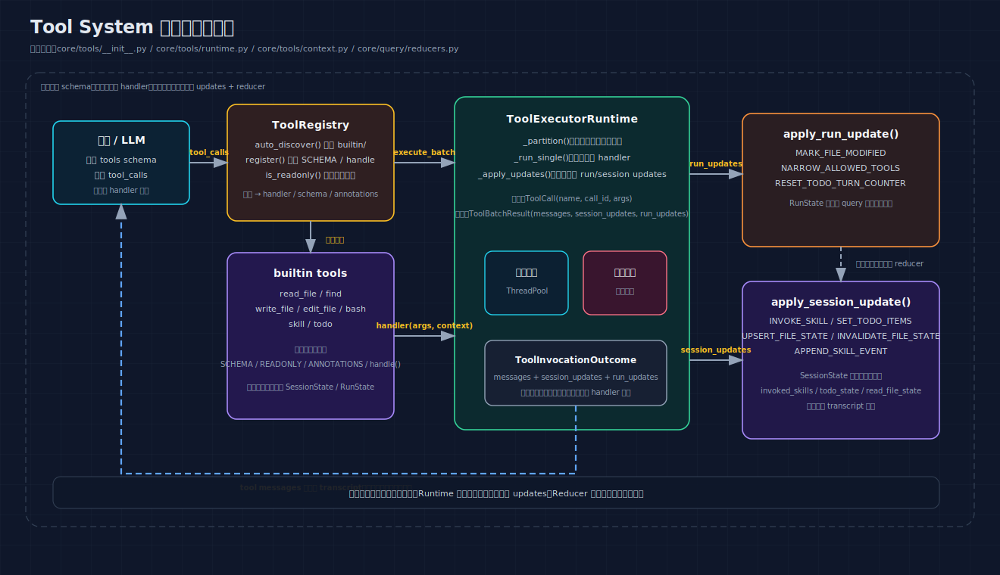
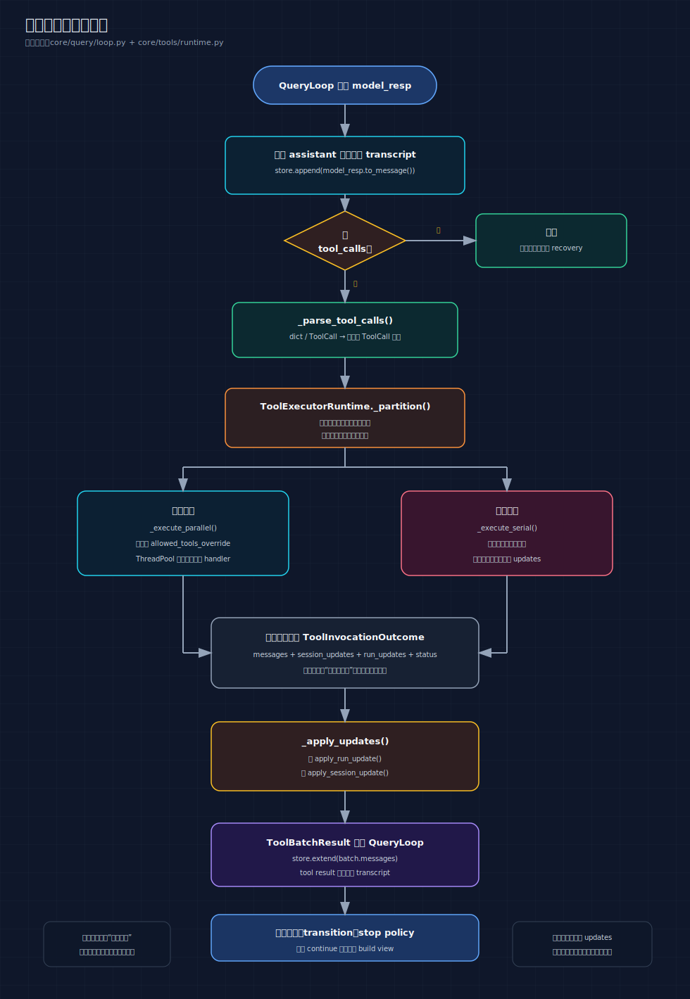

# 02: Tool System — 给 AI 的双手

> 上一篇讲了 Agent Loop（AI 的思考循环）。但一个只会思考不会行动的 AI，
> 只能跟你聊天，不能读文件、不能跑命令、不能写代码。
> Tool System 就是让 AI "能做事"的那套机制。

---

## 你将理解什么

读完这篇，你会知道：

1. 为什么 AI 需要工具？没有工具会怎样？
2. AI 怎么知道有哪些工具可以用？
3. AI 说"我要读文件"时，系统怎么找到对应的代码并执行？
4. 如果 AI 一次要调多个工具，先执行哪个？可以并行吗？
5. 工具执行出错怎么办？

---

## 第一个问题：为什么 AI 需要工具

### 没有 tools 的 AI

```text
你： "帮我看看 config.yaml 里的 debug 设置"

AI（没有工具）：
  "我无法直接查看你的文件。你可以把文件内容粘贴给我，
   我来帮你分析。或者你也可以这样查看：
   1. 打开终端
   2. 输入 cat config.yaml
   3. 找到 debug 那一行..."
```

AI 只能"告诉你怎么做"，不能"帮你做"。

### 有 tools 的 AI

```text
你： "帮我看看 config.yaml 里的 debug 设置"

AI（有工具）：
  → 调用 read_file 工具：{"path": "config.yaml"}
  → 系统执行，返回文件内容
  → AI 看到内容

AI：
  "config.yaml 中的 debug 设置为 true。
   第 3 行：debug: true
   你需要改成 false 吗？"
```

AI 直接"帮你做了"。

### 对比

| | 没有 tools | 有 tools |
|---|---|---|
| 读文件 | "你可以打开文件看看..." | 直接读取，告诉你内容 |
| 执行命令 | "你可以在终端运行..." | 直接执行，给你结果 |
| 写代码 | "你可以创建一个文件..." | 直接创建，运行测试 |
| 本质 | **顾问** — 告诉你该怎么做 | **执行者** — 帮你做 |

---

## 整体架构

工具系统由三层组成：

```text
┌─────────────────────────────────────────────────────────────┐
│                       模型（AI）                             │
│  看到：工具的 Schema 描述（JSON）                              │
│  输出：tool_calls（选择调用哪个工具，传什么参数）               │
└──────────────────────┬──────────────────────────────────────┘
                       │ tool_calls
                       ▼
┌─────────────────────────────────────────────────────────────┐
│                  ToolRegistry（工具注册表）                    │
│  职责：根据名字找到对应的工具 handler                           │
│  存储：名字 → handler 的映射                                  │
└──────────────────────┬──────────────────────────────────────┘
                       │ handler(args, context)
                       ▼
┌─────────────────────────────────────────────────────────────┐
│                  ToolExecutorRuntime（执行引擎）               │
│  职责：调度工具执行（并行/串行）、应用更新、收集结果             │
└─────────────────────────────────────────────────────────────┘
```

### 先看两张对应当前实现的图

第一张回答“这一层到底怎么分工”：



第二张回答“tool_calls 进来以后到底怎么流动”：



把这两张图和代码一起看，会更容易抓住当前实现最重要的边界：

- 模型只看到 schema，不知道 handler 细节
- `ToolExecutorRuntime` 负责分批和调度
- 工具返回 `ToolInvocationOutcome`
- 真正写 `SessionState` / `RunState` 的是 reducer，不是工具本身

---

## 工具的注册与发现

### 每个工具长什么样

每个工具是一个 Python 文件，放在 `core/tools/builtin/` 目录下。一个工具文件只需要暴露 4 样东西：

```python
# 以 read_file 为例 (core/tools/builtin/read_file.py)

# ── 1. SCHEMA：告诉模型"这个工具叫什么、接受什么参数" ──
#
# 这是模型唯一看到的"工具说明书"。模型根据这个描述来决定：
# - 要不要调用这个工具
# - 调用时传什么参数
SCHEMA = {
    "name": "read_file",
    "description": "读取文件内容，支持行号范围",
    "input_schema": {
        "type": "object",
        "properties": {
            "path": {
                "type": "string",
                "description": "要读取的文件路径"
            },
            "offset": {
                "type": "integer",
                "description": "起始行号（从 1 开始）"
            },
            "limit": {
                "type": "integer",
                "description": "最多读取多少行"
            },
        },
        "required": ["path"],
    },
}

# ── 2. READONLY：标记这个工具是否只读 ──
#
# 只读工具可以并行执行（读两个文件不会冲突）
# 写入工具必须串行执行（同时写两个文件可能冲突）
READONLY = True

# ── 3. ANNOTATIONS：更细粒度的属性标记 ──
#
# 当前实现里，readonly 会参与执行逻辑；
# 其他标记主要用于展示和安全语义
ANNOTATIONS = {
    "readonly": True,           # 只读，不修改任何东西
    "destructive": False,       # 不会破坏性操作
    "idempotent": True,         # 多次调用结果相同
    "concurrency_safe": True,   # 可以安全地并发调用
}

# ── 4. handle()：实际执行函数 ──
#
# args: 模型传来的参数（dict）
# context: 工具执行环境（工作目录、session 状态等，只读）
# 返回: ToolInvocationOutcome（结果 + 状态更新）
def handle(args: dict, context: ToolUseContext) -> ToolInvocationOutcome:
    path = args.get("path", "")
    offset = args.get("offset", 1)
    limit = args.get("limit")

    # ... 读取文件的逻辑 ...

    return ToolInvocationOutcome(
        messages=[make_tool_message(context, file_content)],
        session_updates=[...],
    )
```

### 自动发现机制

系统启动时，`auto_discover()` 会自动扫描 `core/tools/builtin/` 下的所有 `.py` 文件：

```python
# core/tools/__init__.py
def auto_discover() -> ToolRegistry:
    reg = ToolRegistry()
    tools_dir = pathlib.Path(__file__).parent / "builtin"
    for file in tools_dir.glob("*.py"):
        if file.name.startswith("_"):    # 跳过 __init__.py
            continue
        module = importlib.import_module(f"core.tools.builtin.{file.stem}")
        reg.register(module)
    return reg
```

这意味着：**新增工具只需要在 `core/tools/builtin/` 下新建一个 `.py` 文件，暴露 `SCHEMA` + `handle()`，重启就会自动被发现。** 不需要修改任何注册代码。

### 7 个内置工具一览

| 工具名 | 文件 | 只读 | 做什么 | 典型参数 |
|---|---|---|---|---|
| `bash` | `builtin/bash.py` | 否 | 执行 shell 命令 | `{"command": "ls -la"}` |
| `read_file` | `builtin/read_file.py` | 是 | 读取文件内容 | `{"path": "README.md"}` |
| `write_file` | `builtin/write_file.py` | 否 | 创建/覆盖/追加文件 | `{"path": "out.txt", "content": "hello"}` |
| `edit_file` | `builtin/edit_file.py` | 否 | 替换文件中的字符串 | `{"path": "f.py", "old": "x=1", "new": "x=2"}` |
| `find` | `builtin/find.py` | 是 | 搜索文件名 | `{"pattern": "**/*.py"}` |
| `skill` | `builtin/skill.py` | 否 | 激活一个 skill | `{"skill": "analysis-report"}` |
| `todo` | `builtin/todo.py` | 否 | 更新任务计划 | `{"items": [...]}` |

---

## ToolRegistry — 工具的查找和执行

### 注册

```python
class ToolRegistry:
    def register(self, module):
        """注册一个工具模块"""
        schema = module.SCHEMA
        name = schema["name"]
        self._handlers[name] = module.handle
        self._schemas[name] = schema
        self._readonly[name] = getattr(module, "READONLY", False)
        self._annotations[name] = getattr(module, "ANNOTATIONS", {})
        self._required_params[name] = schema.get("input_schema", {}).get("required", [])
```

### 执行

```python
def execute(self, name: str, args: dict, context: ToolUseContext) -> ToolInvocationOutcome:
    handler = self._handlers.get(name)
    if not handler:
        return ToolInvocationOutcome(status=FAILURE, error="not_found", ...)

    # 校验必填参数
    required = self._required_params.get(name, [])
    missing = [p for p in required if p not in args]
    if missing:
        return ToolInvocationOutcome(status=FAILURE, error="missing_params", ...)

    # 调用 handler
    return handler(args, context)
```

### 过滤

```python
def filtered(self, allowed_names) -> ToolRegistry:
    """创建一个只包含允许工具的新注册表"""
    new_reg = ToolRegistry()
    for name in allowed_names:
        if name in self._handlers:
            new_reg._handlers[name] = self._handlers[name]
            new_reg._schemas[name] = self._schemas[name]
            # ... 复制其他属性 ...
    return new_reg
```

用于 subagent 场景——探索型子 Agent 只能用 find 和 read_file。

---

## ToolUseContext — 工具能"看到"什么

每个工具执行时会收到一个 `ToolUseContext` 对象。这是工具能访问的**只读环境信息**：

```python
class ToolUseContext:
    # ── 基础环境 ──
    working_dir: str          # 当前工作目录，比如 "/home/user/project"
    max_turns: int            # 轮次上限，比如 300

    # ── 当前调用信息 ──
    tool_name: str            # 当前工具名，比如 "read_file"
    tool_call_id: str         # API 分配的调用 ID，比如 "toolu_abc123"
    turn_count: int           # 当前是第几轮，比如 3

    # ── 运行时状态（只读）──
    session_state: SessionState  # 会话状态（对话历史、skill、todo 等）
    skill_registry: SkillRegistry  # skill 注册表

    # ── 取消标记 ──
    cancelled: bool           # 是否被用户取消了
```

### 为什么工具只能读不能写

旧设计中，工具可以直接修改 `session_state`：

```python
# 旧方式（已删除）
def handle(args, context):
    context.session_state.read_file_state[path] = FileState(...)  # 直接写！
    context.session_state.todo_state.items = [...]                 # 直接写！
```

问题：

1. **不知道谁改的** — 状态什么时候被什么工具改的，无法追踪
2. **难以测试** — 工具直接改了状态，断言起来很别扭
3. **难以调试** — 状态变更散落在各处，出问题很难定位

新设计中，工具返回结构化的"更新指令"：

```python
# 新方式（当前）
def handle(args, context):
    return ToolInvocationOutcome(
        messages=[...],              # 模型看到的结果
        session_updates=[...],       # 对 session_state 的更新指令
        run_updates=[...],           # 对 run_state 的更新指令
    )
```

更新由 reducer 函数统一应用（详见 [03-tool-control-plane.md](./03-tool-control-plane.md)）。

### 当前实现里最关键的一条边界

很多人第一次看工具系统，会下意识把它理解成：

```text
模型调工具
→ 工具直接改 session_state
→ loop 继续
```

但当前真实路径是：

```text
模型调工具
→ ToolExecutorRuntime 执行 handler
→ handler 返回 ToolInvocationOutcome
→ runtime 应用 run/session updates
→ reducer 写入 RunState / SessionState
→ QueryLoop 再进入下一轮
```

这条边界为什么重要：

- 副作用入口统一，测试可以断言“工具声明了什么更新”
- 并行只读批次不会把状态写乱
- `allowed_tools_override`、todo 计数器、skill 激活这些控制语义才能稳定生效

---

## ToolExecutorRuntime — 工具的调度引擎

当模型一次返回多个工具调用时，需要决定执行顺序。

### 核心调度规则

```text
只读工具（READONLY=True）→ 可以并行执行
写入工具（READONLY=False）→ 必须串行执行
```

为什么？

```text
并行读 A.txt 和 B.txt：
  → 没有冲突，同时跑更快

并行写 A.txt 和写 B.txt：
  → 一般不会冲突，但工具的副作用可能有依赖
  → 比如 write_file 会更新文件缓存，后续工具可能依赖缓存

串行执行更安全：
  write_file(A) → 更新缓存 → read_file(A) 能看到新内容
```

### 分区算法详解

`_partition()` 把一个工具调用列表分成多个批次：

```python
# core/tools/runtime.py
def _partition(self, calls):
    batches = []
    current_parallel = []

    for call in calls:
        is_readonly = self._registry.is_readonly(call.name)

        if is_readonly:
            current_parallel.append(call)  # 只读工具归入当前并行批次
        else:
            if current_parallel:
                batches.append(Batch(current_parallel, parallel=True))
                current_parallel = []
            batches.append(Batch([call], parallel=False))  # 写入工具单独串行

    if current_parallel:
        batches.append(Batch(current_parallel, parallel=True))

    return batches
```

具体例子：

```text
模型返回：[read_file(A), read_file(B), edit_file(C), read_file(D), bash("ls"), write_file(E)]

分区结果：
  批次 0: [read_file(A), read_file(B)]     → 并行（两个只读）
  批次 1: [edit_file(C)]                   → 串行（写入）
  批次 2: [read_file(D)]                   → 并行（只读）
  批次 3: [bash("ls")]                     → 串行（写入）
  批次 4: [write_file(E)]                  → 串行（写入）
```

### 并行执行详解

```python
def _execute_parallel(self, batch):
    results = {}
    with ThreadPoolExecutor(max_workers=len(batch.calls)) as pool:
        # 每个工具调用提交到线程池
        futures = {pool.submit(self._run_single, call): call.idx for call in batch.calls}

        # 等待所有完成
        for future in as_completed(futures):
            idx = futures[future]
            results[idx] = future.result()

    # 按原始调用顺序应用更新（保证稳定可复现）
    for call in sorted(batch.calls, key=lambda c: c.idx):
        self._apply_updates(results[call.idx])
```

为什么按原始顺序应用更新？

```text
并行执行：[read_file(A), read_file(B)]

可能完成顺序：B 先完成，A 后完成

但更新应用顺序：先 A 后 B（按原始调用顺序）

为什么？因为如果先应用 B 的更新，再应用 A 的更新，
某些状态（比如文件缓存）的最终状态会取决于线程调度，
这是不可预测的。按固定顺序应用，结果才稳定。
```

### 串行执行详解

```python
def _execute_serial(self, batch):
    for call in batch.calls:
        # 1. 检查是否被工具限制
        if allowed_tools and call.name not in allowed_tools:
            results[call.idx] = ToolInvocationOutcome(
                status=BLOCKED,
                messages=[f"Tool '{call.name}' rejected: no longer allowed"],
            )
            continue

        # 2. 执行工具
        outcome = self._run_single(call)
        results[call.idx] = outcome

        # 3. 立即应用更新！
        self._apply_updates(outcome)
```

关键：**串行执行中，每个工具执行完后立即应用更新。** 下一个工具能看到前一个的副作用。

```text
串行执行：[write_file("data.txt", "hello"), read_file("data.txt")]

write_file 执行完：
  → 立即更新 session_state.read_file_state["data.txt"] = "hello"

read_file 执行：
  → context.get_file_state("data.txt") 返回 "hello"
  → 它能立即看到 write_file 的结果
```

### 单个工具的执行

每个工具在独立线程中执行（即使串行也是在线程里跑，方便统一超时和进度显示）：

```python
def _run_single(self, call):
    thread = Thread(target=run)
    thread.start()

    while thread.is_alive():
        thread.join(timeout=1.0)
        # 每秒检查一次，显示进度
        if elapsed >= 2:
            show_status(f"{call.name} 执行中... {elapsed}s")

    if exception:
        return ToolInvocationOutcome(status=FAILURE, error="internal_error", ...)
    return outcome
```

---

## 工具安全机制

### bash — 命令分级防护

```python
# core/tools/builtin/bash.py

# 第一级：完全禁止的命令（直接拒绝）
BLOCKED_COMMANDS = [
    "mkfs",       # 格式化磁盘
    "dd if=",     # 磁盘复制（可能覆盖数据）
    "format",     # 格式化
    ":(){ :|:&",  # fork bomb
]

# 第二级：需要用户确认的命令
CONFIRM_COMMANDS = [
    "rm",         # 删除文件
    "sudo",       # 管理员权限
    "chmod",      # 修改权限
    "shutdown",   # 关机
    "reboot",     # 重启
]
```

执行流程：

```text
模型调用 bash("rm -rf /tmp/test")

系统检查：
  "rm" 在 CONFIRM_COMMANDS 里吗？→ 是

显示给用户：
  "⚠️  即将执行危险命令：rm -rf /tmp/test
   是否继续？[y/N]"

用户输入 y → 执行
用户输入 N → 返回 CANCELLED
```

### edit_file — 读后写保护

```python
# core/tools/builtin/edit_file.py
def handle(args, context):
    path = args.get("path")
    old_string = args.get("old")
    new_string = args.get("new")

    # 检查 1：之前是否完整读取过这个文件？
    cached = context.get_file_state(abs_path)
    if not cached or not cached.is_full_read:
        return ToolInvocationOutcome(
            status=FAILURE,
            error="stale",
            messages=["必须先完整读取文件才能编辑"],
        )

    # 检查 2：文件是否被外部修改了？
    disk_mtime = os.path.getmtime(abs_path)
    if cached.timestamp != disk_mtime:
        return ToolInvocationOutcome(
            status=FAILURE,
            error="stale",
            messages=["文件已被外部修改，请重新读取"],
        )

    # 检查 3：old_string 确实存在于文件中
    content = read_file(abs_path)
    if old_string not in content:
        return ToolInvocationOutcome(
            status=FAILURE,
            error="not_found",
            messages=[f"未找到匹配的字符串"],
        )

    # 全部通过，执行替换
    new_content = content.replace(old_string, new_string, count=1)
    write_file(abs_path, new_content)
```

三重保护：

1. **必须先读过** — 防止盲改
2. **磁盘时间戳必须一致** — 防止改了别人改过的文件
3. **old_string 必须存在** — 防止改错位置

### 输出截断

```python
MAX_OUTPUT_CHARS = 30000  # 3 万字符

if len(content) > MAX_OUTPUT_CHARS:
    truncated = content[:MAX_OUTPUT_CHARS]
    truncated += f"\n\n... (输出已截断，原始 {len(content)} 字符，显示前 {MAX_OUTPUT_CHARS} 字符)"
```

防止一个超大文件把模型的上下文窗口撑爆。

---

## 模型怎么看工具

模型看到的不是 Python 代码，而是工具的 **Schema**（JSON 格式的描述）：

```json
{
  "name": "read_file",
  "description": "读取文件内容，支持行号范围",
  "input_schema": {
    "type": "object",
    "properties": {
      "path": {"type": "string", "description": "要读取的文件路径"},
      "offset": {"type": "integer", "description": "起始行号（从 1 开始）"},
      "limit": {"type": "integer", "description": "最多读取多少行"}
    },
    "required": ["path"]
  }
}
```

模型根据这个描述来决定：

1. "用户让我看 config.yaml" → 我应该调用 `read_file`
2. `read_file` 需要 `path` 参数 → 传 `"config.yaml"`
3. `offset` 和 `limit` 不是必填的 → 用户没指定就不传

模型返回的格式：

```json
{
  "tool_calls": [
    {
      "id": "toolu_abc123",
      "name": "read_file",
      "args": {"path": "config.yaml"}
    }
  ]
}
```

系统解析这个 JSON，调用对应的 handler，把结果返回给模型。

---

## 完整执行示例

```text
用户： "帮我看看 src/main.py 和 README.md，然后把 main.py 里的 print 改成 logger"

── 轮次 1 ──

模型想："先读这两个文件"
模型输出 tool_calls:
  [
    {"name": "read_file", "args": {"path": "src/main.py"}},
    {"name": "read_file", "args": {"path": "README.md"}}
  ]

分区：两个 read_file 都是只读 → 并行执行
  Thread 1: read_file("src/main.py") → 返回文件内容（50 行）
  Thread 2: read_file("README.md")  → 返回文件内容（20 行）
按顺序应用更新：两个 UPSERT_FILE_STATE

工具结果追加到对话历史
turn_count = 1, transition = NEXT_TURN
continue

── 轮次 2 ──

模型看到两个文件的内容，想："把 print 替换成 logger"
模型输出 tool_calls:
  [{"name": "edit_file", "args": {
    "path": "src/main.py",
    "old": "print(",
    "new": "logger.info("
  }}]

分区：edit_file 是写入 → 串行执行
  检查：之前读过 src/main.py 且是完整读取 ✓
  检查：磁盘 mtime 和缓存一致 ✓
  检查："print(" 存在于文件中 ✓
  执行替换：3 处匹配
  返回 "已替换 3 处匹配"

工具结果追加到对话历史
turn_count = 2, transition = NEXT_TURN
continue

── 轮次 3 ──

模型想："替换完成了，回复用户"
模型输出：
  content: "已将 src/main.py 中的 3 处 print() 替换为 logger.info()。
            README.md 内容已查看，无需修改。"
  tool_calls: []

→ 命中分支 C，正常结束
→ QueryResult(
    final_output="已将 src/main.py 中的...",
    stop_reason=COMPLETED,
    turns_used=2,
    files_modified=["src/main.py"]
  )
```

---

## 常见疑问

### Q: 模型怎么知道有哪些工具可以用？

A: 每次调 API 时，请求里会带一个 `tools` 字段，包含所有可用工具的 Schema。模型看到的就像一份"工作手册"——"你可以做这些事，每件事需要这些信息"。

### Q: 模型能自己发明新工具吗？

A: 不能。模型只能从系统提供的工具列表中选择。它不能调用列表之外的工具。

### Q: 为什么 read_file 和 write_file 不放在一起？

A: 因为它们的调度策略不同。read_file 是只读的，可以并行；write_file 是写入的，必须串行。分开定义让调度器能自动判断。

### Q: 如果工具执行超时了怎么办？

A: `_run_single` 有超时机制（默认 120 秒）。超时后返回 `FAILURE`，模型会看到错误消息并决定下一步。

### Q: 工具可以返回图片或其他二进制内容吗？

A: 当前不支持。工具返回的都是文本内容。read_file 读取的是文本文件，图片文件目前只能返回"二进制文件，无法显示"。

---

## 关键文件索引

| 文件 | 职责 | 行数 |
|---|---|---|
| `core/tools/__init__.py` | `ToolRegistry` — 注册、发现、执行 | ~130 行 |
| `core/tools/context.py` | `ToolUseContext` — 工具的只读上下文 | ~190 行 |
| `core/tools/runtime.py` | `ToolExecutorRuntime` — 批次调度 | ~430 行 |
| `core/tools/builtin/bash.py` | Shell 命令执行 + 安全检查 | ~150 行 |
| `core/tools/builtin/read_file.py` | 文件读取 | ~230 行 |
| `core/tools/builtin/write_file.py` | 文件写入 | ~160 行 |
| `core/tools/builtin/edit_file.py` | 文件编辑（替换） | ~210 行 |
| `core/tools/builtin/find.py` | 文件搜索 | ~140 行 |
| `core/tools/builtin/skill.py` | Skill 激活 | ~120 行 |
| `core/tools/builtin/todo.py` | Todo 更新 | ~190 行 |

---

## 一句话记住

**Tool System 不只是给模型几个函数调用接口，而是把“能力暴露、批次调度、结构化回写、统一 reducer 落状态”串成了一条可测试的执行链。**
