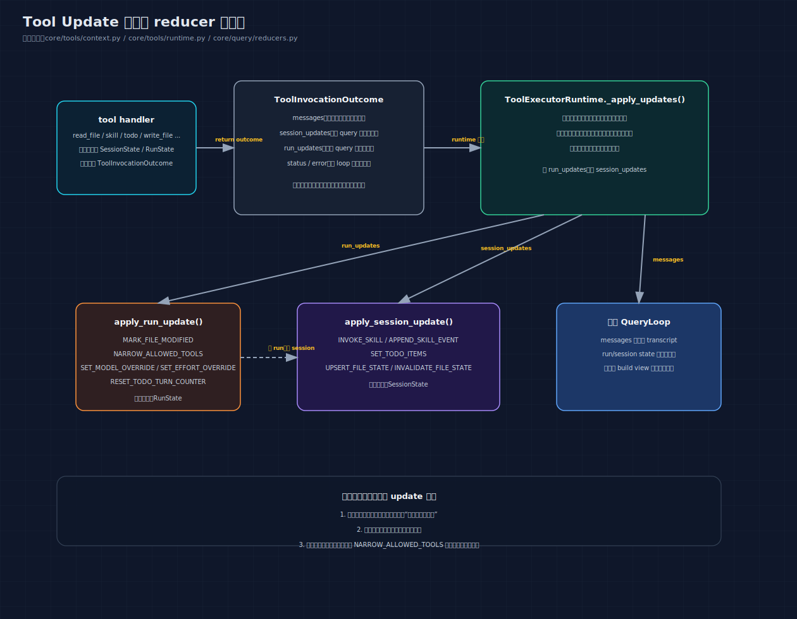

# 03: Tool Control Plane — 工具如何与系统通信

> 前两篇讲了"AI 怎么思考"和"AI 怎么做事"。这篇解决一个更底层的问题：
> 工具做完事后，它的副作用（改了文件、缓存了内容、激活了 skill）
> 怎么传达给系统？为什么不能让工具直接改全局变量？

---

## 你将理解什么

读完这篇，你会知道：

1. 为什么不能让工具直接修改全局状态
2. `ToolInvocationOutcome` 是什么，为什么需要它
3. `SessionUpdate` 和 `RunUpdate` 有什么区别
4. "reducer"是什么，为什么所有状态变更都要经过它
5. 并行执行和串行执行时，状态更新的顺序有什么不同

---

## 第一个问题：为什么工具不能直接改状态

### 旧做法

在重构之前，工具可以直接修改 `session_state`：

```python
# 旧方式（已删除）
def read_file_handle(args, context):
    content = read_file_from_disk(path)
    # 直接修改 session_state！
    context.session_state.read_file_state[path] = FileState(content=content)
    return ToolResult(output=content, success=True)

def todo_handle(args, context):
    items = parse_items(args)
    # 直接修改 session_state！
    context.session_state.todo_state.items = items
    return ToolResult(output="ok", success=True)

def skill_handle(args, context):
    # 直接修改 session_state！
    context.session_state.invoked_skills[skill_id] = record
    # 还要返回 barrier 中断当前批次！
    return ToolResult(output="ok", barrier=ExecutionBarrier(...))
```

### 出了什么问题

#### 问题 1：不知道谁改了什么

```text
某次运行后 session_state.read_file_state 多了一个文件
→ 是 read_file 加的？还是 edit_file 加的？还是 write_file 加的？
→ 没有记录，只能靠阅读每个工具的源码来排查
```

#### 问题 2：工具可以绕过安全检查

```python
# 某个工具可以直接修改 allowed_tools
context.session_state.allowed_tools = set()  # 清空所有工具限制！
```

没有入口控制，任何工具可以做任何事。

#### 问题 3：难以测试

```python
def test_todo_tool():
    handle({"items": [...]}, context)
    # 断言：state 被正确修改了
    assert context.session_state.todo_state.items == expected  # 直接读内部状态

    # 但如果测试失败，你不知道是 handle 的逻辑错了
    # 还是 state 的初始状态不对
```

#### 问题 4：并行执行时状态竞争

```text
并行执行：[read_file(A), read_file(B)]

Thread 1: context.session_state.read_file_state["A"] = ...
Thread 2: context.session_state.read_file_state["B"] = ...

两个线程同时写 dict，可能导致数据不一致
```

### 新做法：结构化更新

```python
# 新方式（当前）
def read_file_handle(args, context):
    content = read_file_from_disk(path)
    return ToolInvocationOutcome(
        messages=[make_tool_message(context, content)],
        session_updates=[
            SessionUpdate(kind=UPSERT_FILE_STATE, payload={"path": path, "file_state": ...})
        ],
    )
```

工具不直接改状态。它**声明**"我想做什么变更"，由系统统一执行。

### 先看一张 update 协议图



这张图把当前实现里最容易混淆的 4 类东西拆开了：

- tool handler 产出 `ToolInvocationOutcome`
- `messages` 回到 transcript
- `run_updates` 进 `RunState`
- `session_updates` 进 `SessionState`

这样你读后面的 reducer 和时序，就不会再把“给模型看的消息”和“真正改状态的更新”混成一层。

---

## ToolInvocationOutcome — 工具的统一返回格式

### 结构

```python
@dataclass(slots=True)
class ToolInvocationOutcome:
    status: ToolOutcomeStatus = ToolOutcomeStatus.SUCCESS
    session_updates: list[SessionUpdate] = field(default_factory=list)
    run_updates: list[RunUpdate] = field(default_factory=list)
    messages: list[dict] = field(default_factory=list)
    error: str | None = None
```

### 四个字段的含义

```text
┌──────────────────────────────────────────────────────────────┐
│              ToolInvocationOutcome                            │
│                                                              │
│  messages          → 给模型看的结果                            │
│  session_updates   → 跨查询的长期状态变更                      │
│  run_updates       → 单次查询的状态变更                        │
│  status + error    → 成功/失败/被阻断的语义                    │
└──────────────────────────────────────────────────────────────┘
```

### 为什么分这四类

因为它们的**消费者**不同：

```text
messages（给模型看的）
  "config.yaml 的内容是：debug: true\nport: 8080"
  消费者：下一轮的模型
  路径：追加到 conversation_messages

session_updates（给 session state 用的）
  缓存文件内容、更新 todo 列表、激活 skill
  消费者：apply_session_update() reducer
  路径：修改 SessionState（跨 query 持久化）

run_updates（给 run state 用的）
  标记文件被修改、限制工具集
  消费者：apply_run_update() reducer
  路径：修改 RunState（query 结束就消失）

status（给 loop 用的）
  SUCCESS / FAILURE / BLOCKED / CANCELLED
  消费者：QueryLoop 的控制流
  路径：影响是否继续、如何报告结果
```

如果不分开，loop 就要做"某个字段是给模型看的，某个是给状态用的"这种二次翻译。

### ToolOutcomeStatus — 工具的完成语义

```python
class ToolOutcomeStatus(StrEnum):
    SUCCESS = "success"       # 正常完成
    FAILURE = "failure"       # 执行失败（超时、OS 错误等）
    BLOCKED = "blocked"       # 被安全策略阻止（禁止的命令）
    NEEDS_USER = "needs_user" # 需要用户介入（预留）
    CANCELLED = "cancelled"   # 用户取消了（拒绝了风险命令）
```

具体使用场景：

```text
bash("ls")         → SUCCESS
bash("cat f.txt")  → SUCCESS
bash("mkfs /dev/sda1")  → BLOCKED（命令在禁止列表里）
bash("rm -rf /tmp/test") → 用户确认 N → CANCELLED
bash("python --invalid") → FAILURE（命令返回非零退出码）
bash("sleep 999999")     → FAILURE（超时）
read_file("/not/exist")  → FAILURE（文件不存在）
```

---

## SessionUpdate — 跨查询的长期状态更新

### 什么是"跨查询"

用户每次输入触发一次 query。但有些状态需要**跨多次查询保持**：

```text
第 1 次输入："读一下 config.yaml"
  → read_file 缓存了文件内容
  → session_state.read_file_state["config.yaml"] = FileState(...)

第 2 次输入："把 debug 改成 false"
  → edit_file 需要检查之前读过的文件内容
  → 从 session_state.read_file_state["config.yaml"] 获取缓存
```

如果缓存只在单次 query 内有效，edit_file 就无法检查"之前是否读过这个文件"。

### 五种 SessionUpdate

```python
class SessionUpdateKind(StrEnum):
    INVOKE_SKILL = "invoke_skill"
    SET_TODO_ITEMS = "set_todo_items"
    UPSERT_FILE_STATE = "upsert_file_state"
    INVALIDATE_FILE_STATE = "invalidate_file_state"
    APPEND_SKILL_EVENT = "append_skill_event"
```

每种更新携带不同的 payload：

#### INVOKE_SKILL

```python
SessionUpdate(
    kind=SessionUpdateKind.INVOKE_SKILL,
    payload={
        "invoked_skill": InvokedSkillRecord(
            skill_id="analysis-report",
            content="<skill-runtime>...</skill-runtime>",  # 渲染好的 XML
            invoked_at_turn=3,
        ),
    },
)
```

谁返回：`skill` 工具
效果：把 skill 的完整内容写入 `session_state.invoked_skills`
后续：下一轮模型输入中，system prompt 会包含这个 skill 的完整指令

#### SET_TODO_ITEMS

```python
SessionUpdate(
    kind=SessionUpdateKind.SET_TODO_ITEMS,
    payload={
        "items": [
            TodoItem(content="读取文件", active_form="正在读取", status="completed"),
            TodoItem(content="分析数据", active_form="正在分析", status="in_progress"),
        ],
        "last_write_turn": 5,
    },
)
```

谁返回：`todo` 工具
效果：替换 `session_state.todo_state.items`，记录写入轮次
注意：**全量替换**，不是增量更新。模型必须提供完整的任务列表。

#### UPSERT_FILE_STATE

```python
SessionUpdate(
    kind=SessionUpdateKind.UPSERT_FILE_STATE,
    payload={
        "path": "/home/user/project/config.yaml",
        "file_state": FileState(
            content="debug: true\nport: 8080",
            timestamp=1714089600.0,  # 文件的修改时间
        ),
    },
)
```

谁返回：`read_file`、`write_file`、`edit_file`
效果：缓存文件内容到 `session_state.read_file_state[path]`
用途：edit_file 执行前检查"之前是否完整读过这个文件"

#### INVALIDATE_FILE_STATE

```python
SessionUpdate(
    kind=SessionUpdateKind.INVALIDATE_FILE_STATE,
    payload={"path": "/home/user/project/config.yaml"},
)
```

谁触发：`collect_runtime_maintenance_updates()`（循环每轮自动运行）
条件：磁盘上的文件修改时间与缓存的时间不一致
效果：从 `session_state.read_file_state` 中移除这个文件
用途：确保模型下次读到的不是过时的缓存

#### APPEND_SKILL_EVENT

```python
SessionUpdate(
    kind=SessionUpdateKind.APPEND_SKILL_EVENT,
    payload={
        "skill_event": SkillEvent(
            skill_id="analysis-report",
            action="activated",
            source="model_tool_call",
        ),
    },
)
```

谁返回：`skill` 工具
效果：往 `session_state.skill_events` 追加一条审计日志
用途：记录 skill 的生命周期事件（当前主要是激活、重载等）

---

## RunUpdate — 单次查询内的状态更新

### 什么是"单次查询"

有些状态只在当前 query 内有意义，query 结束后就不需要了：

```text
"本轮修改了哪些文件" → 只在当前查询内需要，最终报告给用户
"限制了哪些工具"   → 只在当前查询内需要
```

下一次用户输入时，`RunState` 会重新创建，这些状态自然清空。

### 五种 RunUpdate

```python
class RunUpdateKind(StrEnum):
    MARK_FILE_MODIFIED = "mark_file_modified"
    NARROW_ALLOWED_TOOLS = "narrow_allowed_tools"
    SET_MODEL_OVERRIDE = "set_model_override"
    SET_EFFORT_OVERRIDE = "set_effort_override"
    RESET_TODO_TURN_COUNTER = "reset_todo_turn_counter"
```

#### MARK_FILE_MODIFIED

```python
RunUpdate(
    kind=RunUpdateKind.MARK_FILE_MODIFIED,
    payload={"path": "/home/user/project/config.yaml"},
)
```

效果：把路径追加到 `run_state.files_modified`
最终用途：`QueryResult.files_modified` 里告诉用户"改了哪些文件"

#### NARROW_ALLOWED_TOOLS — 特别重要的安全机制

```python
RunUpdate(
    kind=RunUpdateKind.NARROW_ALLOWED_TOOLS,
    payload={"allowed_tools": {"read_file", "write_file"}},
)
```

效果：缩小可用工具集

```text
初始状态：所有工具都可用
skill 工具返回 NARROW_ALLOWED_TOOLS(["read_file", "write_file"])
  → allowed_tools_override = {"read_file", "write_file"}

后续轮次，模型只会看到 read_file 和 write_file
其他工具（bash、edit_file 等）对模型不可见

再收到 NARROW_ALLOWED_TOOLS(["read_file"])
  → allowed_tools_override = {"read_file", "write_file"} & {"read_file"}
  → allowed_tools_override = {"read_file"}

只能缩小，不能放大。
```

在串行执行路径中，这个限制**立即生效**：

```text
串行执行：[narrow_tool, write_file, bash]

narrow_tool 执行完：
  → 立即应用 NARROW_ALLOWED_TOOLS(["write_file"])
  → allowed_tools_override = {"write_file"}

write_file 执行：
  → "write_file" 在允许列表里 → 正常执行

bash 执行：
  → "bash" 不在允许列表里 → 返回 BLOCKED
  → 消息："Tool 'bash' rejected: no longer allowed in this run."
```

#### SET_MODEL_OVERRIDE / SET_EFFORT_OVERRIDE

```python
RunUpdate(kind=RunUpdateKind.SET_MODEL_OVERRIDE, payload={"model_override": "claude-opus-4-20250514"})
RunUpdate(kind=RunUpdateKind.SET_EFFORT_OVERRIDE, payload={"effort_override": "high"})
```

效果：切换后续轮次使用的模型或推理深度。允许 skill 激活时动态调整。

#### RESET_TODO_TURN_COUNTER

```python
RunUpdate(kind=RunUpdateKind.RESET_TODO_TURN_COUNTER, payload={})
```

效果：把 `run_state.assistant_turns_since_todo` 重置为 0
用途：todo 工具被调用后，重置"连续几轮没更新 todo"的计数器

---

## Reducer — 状态更新的唯一入口

### 什么是 reducer

Reducer 是一个函数，接收"当前状态"和"更新指令"，产生"新状态"：

```text
reducer(state, update) → new_state

实际上：
  apply_session_update(session_state, SessionUpdate) → None  (直接修改 session_state)
  apply_run_update(run_state, RunUpdate) → None  (直接修改 run_state)
```

### 为什么必须是唯一入口

```text
如果允许散落的直接写入：
  工具 A: session_state.foo = 1       ← 在 tool/a.py
  工具 B: session_state.foo = 2       ← 在 tool/b.py
  loop:    session_state.foo = 3       ← 在 query/loop.py
  维护:    session_state.foo = 4       ← 在 query/reducers.py

出问题时：foo 的值是 4，但为什么？要查 4 个文件才能找到。

如果只允许通过 reducer 写入：
  工具 A → SessionUpdate → apply_session_update() → session_state.foo = 1
  工具 B → SessionUpdate → apply_session_update() → session_state.foo = 2
  loop   → SessionUpdate → apply_session_update() → session_state.foo = 3

出问题时：grep "session_updates" 找到所有 Update，grep "apply_session_update" 找到所有应用点。
```

### reducer 的实现

```python
# core/query/reducers.py

def apply_session_update(session_state, update: SessionUpdate) -> None:
    if update.kind == SessionUpdateKind.INVOKE_SKILL:
        record = update.payload.get("invoked_skill")
        if record:
            session_state.invoked_skills[record.skill_id] = record
        return

    if update.kind == SessionUpdateKind.SET_TODO_ITEMS:
        items = list(update.payload.get("items") or [])
        all_completed = bool(items) and all(item.status == "completed" for item in items)
        session_state.todo_state.items = [] if all_completed else items
        session_state.todo_state.last_completed_items = items if all_completed else []
        session_state.todo_state.last_write_turn = update.payload.get("last_write_turn")
        return

    if update.kind == SessionUpdateKind.UPSERT_FILE_STATE:
        path = update.payload.get("path")
        file_state = update.payload.get("file_state")
        if path and file_state is not None:
            session_state.read_file_state[path] = file_state
        return

    if update.kind == SessionUpdateKind.INVALIDATE_FILE_STATE:
        path = update.payload.get("path")
        if path:
            session_state.read_file_state.pop(path, None)
        return

    if update.kind == SessionUpdateKind.APPEND_SKILL_EVENT:
        event = update.payload.get("skill_event")
        if event:
            session_state.skill_events.append(event)
        return

    raise ValueError(f"Unsupported session update: {update.kind}")
```

注意最后一行：**如果收到未知的 update 类型，直接报错。** 这防止了"某个地方传了错误的 update 类型"这种 bug 静默通过。

### 为什么用 payload dict 而不是类型化的 dataclass

```python
# 方案 A：每种 update 一个 dataclass
@dataclass
class InvokeSkillUpdate:
    skill_id: str
    record: InvokedSkillRecord

@dataclass
class SetTodoItemsUpdate:
    items: list[TodoItem]
    last_write_turn: int

# 方案 B：统一 payload dict
SessionUpdate(kind=INVOKE_SKILL, payload={"invoked_skill": record})
```

选择方案 B 的原因：

1. **更容易扩展** — 新增一种 update 只需加 enum 值 + reducer 分支
2. **更容易序列化** — dict 天然可 JSON 序列化
3. **更容易测试** — 不需要为每种类型建 fixture

---

## 每个工具返回什么：完整对照表

| 工具 | messages | session_updates | run_updates |
|---|---|---|---|
| `bash` | 命令输出（或错误信息） | 无 | 无 |
| `read_file` | 文件内容 | `UPSERT_FILE_STATE` | 无 |
| `write_file` | "写入 xxx (N 行)" | `UPSERT_FILE_STATE` | `MARK_FILE_MODIFIED` |
| `edit_file` | "已替换 N 处匹配" | `UPSERT_FILE_STATE` | `MARK_FILE_MODIFIED` |
| `find` | 匹配的文件列表 | 无 | 无 |
| `skill` | "Skill loaded: xxx" | `INVOKE_SKILL` + `APPEND_SKILL_EVENT` | 无 |
| `todo` | 任务进度渲染 | `SET_TODO_ITEMS` | `RESET_TODO_TURN_COUNTER` |

注意规律：

- **只读工具**（bash 的输出、find）只返回 messages，没有 session/run updates
- **写入工具**（write_file、edit_file）同时更新文件缓存和标记文件被修改
- **状态工具**（skill、todo）更新 session 级别的长期状态

---

## 更新的应用时序

### 串行执行：即时应用

```text
串行执行：[write_file(A), read_file(A)]

时间线：
  t0: write_file(A) 开始执行
  t1: write_file(A) 执行完毕
      → 返回 Outcome(
          messages=["写入 A.txt (5 行)"],
          session_updates=[UPSERT_FILE_STATE("A.txt", "hello")],
          run_updates=[MARK_FILE_MODIFIED("A.txt")],
        )
      → 立即调用 apply_session_update(UPSERT_FILE_STATE)
      → 立即调用 apply_run_update(MARK_FILE_MODIFIED)

  t2: read_file(A) 开始执行
      → context.get_file_state("A.txt") 返回 FileState(content="hello")
      → 它能立即看到 write_file 的结果！

  t3: read_file(A) 执行完毕
      → 返回 Outcome(messages=["hello"], session_updates=[UPSERT_FILE_STATE])
      → 立即应用更新
```

### 并行执行：延后合并

```text
并行执行：[read_file(A), read_file(B), read_file(C)]

时间线：
  t0: 三个线程同时开始
  t1: read_file(B) 完成 → 等待其他
  t2: read_file(A) 完成 → 等待其他
  t3: read_file(C) 完成 → 全部完成

  按原始调用顺序应用更新：
    先 A: apply_session_update(UPSERT_FILE_STATE("A.txt", ...))
    再 B: apply_session_update(UPSERT_FILE_STATE("B.txt", ...))
    最后 C: apply_session_update(UPSERT_FILE_STATE("C.txt", ...))

为什么按固定顺序？
  因为如果按完成顺序（B → A → C），每次运行的结果可能不同
  （取决于线程调度），这是不可预测的。
  按原始调用顺序，结果稳定、可测试、可复现。
```

---

## 与旧协议的完整对比

| 维度 | 旧协议 | 新协议 | 改进在哪 |
|---|---|---|---|
| 返回类型 | `ToolResult` | `ToolInvocationOutcome` | 统一了消息通道 |
| 消息通道 | `output` + `injected_messages` 两套 | `messages` 一套 | loop 不做二次翻译 |
| 状态变更 | 工具直接改 `session_state` | `SessionUpdate` + reducer | 可追踪、可测试 |
| 中断机制 | `ExecutionBarrier` | 删除 | 没有工具能中断批次 |
| 上下文覆盖 | `ContextPatch`（能力很窄） | `RunUpdate`（可扩展） | 新增类型只需加 enum |
| 错误表达 | `success: bool` | `ToolOutcomeStatus` 枚举 | 区分失败、阻断、取消 |
| 跨查询状态 | 混在代码各处 | 统一经过 reducer | 未来可加 event sourcing |

---

## 常见疑问

### Q: 为什么不让工具直接返回一个 callback 函数来修改状态？

A: callback（闭包）虽然灵活，但：
1. 不可序列化（无法保存到日志或数据库）
2. 不可比较（无法断言"返回了正确的更新"）
3. 不可重放（未来做 replay 时无法重新执行）

结构化 update 解决了这三个问题。

### Q: 如果 reducer 收到未知的 update 类型怎么办？

A: 直接 `raise ValueError`。这是有意为之——fail fast 比 silently ignore 好。如果某个地方传了错误的类型，报错比静默通过更容易排查。

### Q: payload 为什么是 dict 而不是 TypedDict？

A: 为了简单和可扩展。新增 payload 字段不需要修改类型定义。Reducer 内部自己做字段校验（`payload.get("path")` + `if path` 检查）。

### Q: NARROW_ALLOWED_TOOLS 为什么只能缩小不能放大？

A: 安全考虑。如果工具能放大可用工具集，一个受限的 skill 可以把自己解除限制。取交集是单向门：一旦限制生效，就不能撤销。

---

## 关键文件索引

| 文件 | 职责 | 行数 |
|---|---|---|
| `core/tools/context.py` | 协议类型定义（`ToolInvocationOutcome`, `SessionUpdate`, `RunUpdate`, 各种 enum） | ~75 行协议类型 |
| `core/query/reducers.py` | `apply_session_update()` + `apply_run_update()` + `apply_transition()` | ~110 行 |
| `core/tools/runtime.py` | 执行时应用更新（`_apply_updates()`，串行即时，并行有序） | 是 runtime 的一部分 |

---

## 一句话记住

**Tool Control Plane 的核心不是“多了几个数据类”，而是把工具副作用从隐式直接写，改成了可声明、可合并、可审计的 update 协议。**
