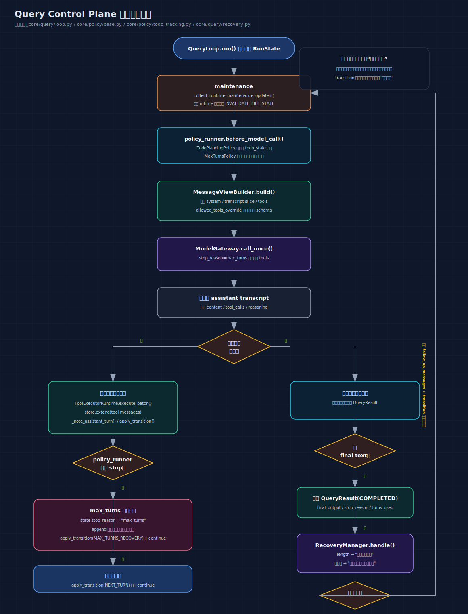

# 04: Query Control Plane — 循环的管理层

> Agent Loop 是"大脑"（思考循环），Tool System 是"双手"（做事能力）。
> 但一个真正的系统还需要一个"管理层"来回答：
> 我们在哪一轮？为什么还没结束？现在属于哪种继续？

---

## 你将理解什么

读完这篇，你会知道：

1. 为什么一个 `while True` 不够，需要额外的管理层
2. "transition" 是什么，为什么每次 continue 都要记录原因
3. Policy 层在什么时机介入，能做什么
4. 模型空响应或输出截断时，RecoveryManager 怎么恢复
5. 每轮开始时，系统静默做了哪些维护工作

---

## 第一个问题：为什么简单的 while True 不够

### 最简版本

```python
while True:
    response = call_model(messages)
    if response.tool_calls:
        execute_tools(response.tool_calls)
        continue
    return response.text
```

这在 demo 里完全够用。但当系统开始长功能后，问题来了：

```text
问题 1：模型空响应了，循环直接退出？还是重试？重试几次？
问题 2：已经跑了 200 轮了还没结束，继续还是强制停止？
问题 3：模型输出被截断了（token 预算用完），怎么续写？
问题 4：连续 10 轮没更新 todo，要不要提醒模型？
问题 5："这次 continue 是因为工具执行完？还是因为截断恢复？" — 出问题时怎么排查？
```

这些问题不是"循环"本身能回答的，而是需要一个**专门的管理层**来处理。

### 什么是"控制平面"

"控制平面"这个词来自网络领域。在路由器里：

```text
数据平面：实际转发数据包（做业务）
控制平面：决定数据包往哪转发（做决策）
```

在 Agent 里：

```text
执行平面：调模型、执行工具、写回消息（做业务）
控制平面：决定循环怎么走、什么时候停、出了问题怎么恢复（做决策）
```

---

## 三层心智模型

把 Query 的整个结构想成三层：

```text
┌────────────────────────────────────────────────────┐
│  1. 输入层                                          │
│     system prompt + messages + tools                │
│     （告诉模型"你在什么环境下工作、能做什么"）          │
│     由 ViewBuilder + PromptAssembler 组装            │
├────────────────────────────────────────────────────┤
│  2. 控制层                                          │
│     RunState + TransitionReason + Policy            │
│     （管理"循环该怎么走、什么时候停"）                  │
│     由 reducers + policy_runner + recovery 管理      │
├────────────────────────────────────────────────────┤
│  3. 执行层                                          │
│     模型调用 + 工具执行                               │
│     （"做事"的地方）                                  │
│     由 model_gateway + tool_runtime 执行             │
└────────────────────────────────────────────────────┘
```

关键原则：**三层不要混在一起。**

```text
错误做法：
  把"空响应重试了几次"塞进 messages[] 里
  把"工具执行了哪些"直接写在 loop 的局部变量里

正确做法：
  控制状态（重试次数、轮次计数、transition）→ RunState
业务数据（对话内容）→ messages[]
  这两者分开管理
```

### 先看当前实现的控制流图

下面这张图可以直接对照 `core/query/loop.py` 阅读：



这张图刻意把两件事分开画了：

- 维护、策略、recovery、max_turns 收尾，属于控制平面
- 调模型、执行工具，属于执行平面

`transition` 记录的是“为什么继续”，不是“做了什么业务”。

---

## Transition — "为什么继续了"

### 核心原则：不要裸 continue

```python
# 不好 — 裸 continue，不知道为什么继续
while True:
    response = call_model()
    if response.tool_calls:
        execute_tools()
        continue  # 为什么继续？因为工具？因为恢复？

# 好 — 带 transition 的 continue
while True:
    response = call_model()
    if response.tool_calls:
        execute_tools()
        apply_transition(state, TransitionReason.NEXT_TURN)  # 因为工具执行完
        continue
```

### 四种 TransitionReason

```python
class TransitionReason(str, Enum):
    NEXT_TURN = "next_turn"                         # 工具执行完，正常继续
    MAX_TURNS_RECOVERY = "max_turns_recovery"       # 到达上限，强制收尾
    EMPTY_RESPONSE_RETRY = "empty_response_retry"   # 模型空响应，重试
    MAX_TOKENS_RECOVERY = "max_tokens_recovery"     # 输出被截断，续写
```

### 在代码里的 3 个 continue 点

```python
# core/query/loop.py

# ── continue 点 1：工具执行后 ──
# 最常见的路径
apply_transition(state, TransitionReason.NEXT_TURN)
continue

# ── continue 点 2：到达轮次上限 ──
state.stop_reason = "max_turns"
apply_transition(state, TransitionReason.MAX_TURNS_RECOVERY)
store.append({"role": "user", "content": "你已达到迭代安全上限..."})
continue

# ── continue 点 3：恢复（空响应/截断）──
decision = recovery.handle(model_resp, state)
if decision.should_continue:
    apply_transition(state, decision.transition_reason)  # EMPTY_RESPONSE_RETRY 或 MAX_TOKENS_RECOVERY
    store.extend(decision.follow_up_messages)
    continue
```

每个 continue 都有结构化原因。**没有裸 continue。**

### Transition 的副作用

`apply_transition()` 不只是记录原因，还会更新计数器：

```python
def apply_transition(run_state, reason: TransitionReason) -> None:
    run_state.transition = reason

    if reason == TransitionReason.NEXT_TURN:
        run_state.empty_retry_count = 0       # 正常推进 → 重置空响应计数
    elif reason == TransitionReason.EMPTY_RESPONSE_RETRY:
        run_state.empty_retry_count += 1      # 空响应 → 递增重试计数
    elif reason == TransitionReason.MAX_TOKENS_RECOVERY:
        run_state.empty_retry_count = 0       # 截断恢复 → 重置计数
```

为什么 `NEXT_TURN` 要重置 `empty_retry_count`？

```text
轮次 1: 工具执行 → NEXT_TURN → empty_retry_count = 0
轮次 2: 空响应 → EMPTY_RESPONSE_RETRY → empty_retry_count = 1
轮次 3: 空响应 → EMPTY_RESPONSE_RETRY → empty_retry_count = 2
轮次 4: 工具执行 → NEXT_TURN → empty_retry_count = 0  ← 重置！
轮次 5: 空响应 → EMPTY_RESPONSE_RETRY → empty_retry_count = 1

逻辑：如果中间有一轮正常执行了工具，说明模型"活过来了"，
之前的空响应不算了，从 0 重新计。
```

### 状态在不同 transition 下的行为矩阵

| 字段 | NEXT_TURN | MAX_TURNS_RECOVERY | EMPTY_RESPONSE_RETRY | MAX_TOKENS_RECOVERY |
|---|---|---|---|---|
| `turn_count` | +1 | 保持 | 保持 | 保持 |
| `empty_retry_count` | 重置为 0 | 保持 | +1 | 重置为 0 |
| `allowed_tools_override` | 保留 | 保留 | 保留 | 保留 |
| `model_override` | 保留 | 保留 | 保留 | 保留 |
| `effort_override` | 保留 | 保留 | 保留 | 保留 |

规则：

- `NEXT_TURN` 是"正常推进"的基线，所以要重置空响应计数
- recovery 类 transition 不清除工具限制（安全约束不能因为恢复而放松）
- 多次空响应会递增计数，最终导致放弃

### Transition 谁在读

当前实现中，`transition` 的主要消费者是**日志和测试**：

```python
# 测试中
def test_empty_response_triggers_retry():
    result = loop.run(...)
    assert result.turns_used == 3
    # 可以通过日志或 debug 看到 transition 的值
    # 确认第 2 轮确实是 EMPTY_RESPONSE_RETRY
```

它还有一次代码级的读取——防止无限循环的守卫检查。

### 参考来源

这个设计的参考来源是 Claude Code 的 `query.ts`。Claude Code 的 `State` 类型里也有 `transition` 字段：

```typescript
type State = {
    // ...
    transition: Continue | undefined  // Why the previous iteration continued
}
```

CC 的注释明确说了 transition 的用途：
> "Lets tests assert recovery paths fired without inspecting message contents."

也就是：让测试能验证"恢复路径确实触发了"，不需要检查消息内容。

---

## Policy — 循环的行为策略

### 什么是 Policy

Policy 是一种"钩子"机制——在循环的特定时机插入自定义行为。

```python
# core/policy/base.py
class RunPolicy(Protocol):
    def before_model_call(self, session_state, run_state) -> list[dict]:
        """调模型前：可以注入消息"""
        ...

    def after_tool_batch(self, session_state, run_state, batch) -> list[dict]:
        """工具执行后：可以注入消息"""
        ...

    def should_stop(self, session_state, run_state) -> str | None:
        """检查是否该停止"""
        ...
```

### PolicyRunner — 策略执行器

```python
class PolicyRunner:
    def __init__(self, policies: list[RunPolicy]):
        self.policies = policies

    def before_model_call(self, session_state, run_state):
        messages = []
        for policy in self.policies:
            messages.extend(policy.before_model_call(session_state, run_state))
        return messages

    def should_stop(self, session_state, run_state):
        for policy in self.policies:
            result = policy.should_stop(session_state, run_state)
            if result is not None:
                return result
        return None
```

多个 policy 按顺序执行，任一个返回"该停止"就停止。

### 目前注册的两个 Policy

```python
# 01_agent_loop.py 启动时
policy_runner = PolicyRunner([
    MaxTurnsPolicy(300),       # 轮次上限
    TodoPlanningPolicy(),      # todo 过期检测
])
```

### MaxTurnsPolicy — 轮次上限

```python
# core/policy/max_turns.py
class MaxTurnsPolicy:
    def __init__(self, max_turns=300):
        self.max_turns = max_turns

    def should_stop(self, session_state, run_state):
        if run_state.turn_count >= self.max_turns:
            return "max_turns"
        return None
```

这个策略只做一件事：检查轮次是否达到上限。

但 loop 里的处理不是直接退出，而是更精细：

```text
步骤 1: policy 返回 "max_turns"
步骤 2: loop 设置 state.stop_reason = "max_turns"
步骤 3: loop 注入 "你已达到迭代安全上限，请给出最终回复"
步骤 4: apply_transition(MAX_TURNS_RECOVERY)
步骤 5: continue → 下一轮

下一轮：
  - view_builder 发现 stop_reason == "max_turns"
  - 不传工具列表给模型
  - 模型看不到工具，只能给文字回复
  - → 正常结束 (StopReason.COMPLETED)

如果模型仍然返回工具调用：
  → 命中分支 A（tool_calls + max_turns）
  → 强制退出 (StopReason.MAX_TURNS)
```

### TodoPlanningPolicy — 计划过期检测

```python
# core/policy/todo_tracking.py
class TodoPlanningPolicy:
    STALE_ASSISTANT_TURNS = 4

    def before_model_call(self, session_state, run_state):
        todo_state = session_state.todo_state

        # 没有计划？不需要提醒
        if not todo_state.items:
            return []

        # 还没超过阈值？不需要提醒
        if run_state.assistant_turns_since_todo < self.STALE_ASSISTANT_TURNS:
            return []

        # 这一轮已经提醒过了？不重复
        if todo_state.last_reminder_turn == run_state.turn_count:
            return []

        # 注入提醒
        snapshot = "\n".join(f"- [{item.status}] {item.content}" for item in todo_state.items)
        return [{
            "role": "user",
            "content": (
                "<system-reminder type=\"todo_stale\">\n"
                "当前计划可能已过时，请先刷新 todo。\n"
                f"{snapshot}\n"
                "</system-reminder>"
            ),
        }]
```

执行过程：

```text
轮次 1: 模型调用 todo 制定计划
  → assistant_turns_since_todo = 0（被 todo 工具重置）

轮次 2: 模型调用 read_file（没调 todo）
  → assistant_turns_since_todo = 1

轮次 3: 模型调用 bash（没调 todo）
  → assistant_turns_since_todo = 2

轮次 4: 模型调用 edit_file（没调 todo）
  → assistant_turns_since_todo = 3

轮次 5: 模型调用 write_file（没调 todo）
  → assistant_turns_since_todo = 4

轮次 6 开始时：
  policy.before_model_call() 检查到 turns_since_todo >= 4
  注入提醒："当前计划可能已过时，请先刷新 todo"
  模型看到提醒，决定是否更新 todo
```

注意三个防护：

1. **没有计划就不提醒** — 没有 todo 列表时不需要提醒
2. **不超过阈值就不提醒** — 4 轮以内是正常的工作节奏
3. **不重复提醒** — `last_reminder_turn` 防止同一轮多次提醒

---

## RecoveryManager — 异常恢复

### 两种异常场景

#### 场景 1：输出被截断（finish_reason = "length"）

```text
模型正在写一个很长的回复：
  "分析结果如下：
   1. 销售趋势：Q1 上升 15%，Q2 下降 8%
   2. 客户分析：Top 5 客户分别是..."
   ← 到这里 token 预算用完了，API 截断输出

finish_reason = "length"（不是 "end_turn"）
```

处理方式：

```python
# core/query/recovery.py
if model_resp.finish_reason == "length":
    return RecoveryDecision(
        should_continue=True,
        follow_up_messages=[{"role": "user", "content": "请继续输出。"}],
        transition_reason=TransitionReason.MAX_TOKENS_RECOVERY,
    )
```

```text
轮次 N:
  模型输出被截断
  → 注入 "请继续输出。"
  → apply_transition(MAX_TOKENS_RECOVERY)
  → continue

轮次 N+1:
  模型看到 "请继续输出。" + 之前的对话
  → 从断点接着写
  → "...3. 建议：..."
```

#### 场景 2：空响应

```text
模型输出：
  content: ""
  tool_calls: []
  finish_reason: "end_turn"

既没有文字，也没有工具调用。模型"失语"了。
```

处理方式：

```python
if not model_resp.has_final_text:
    return RecoveryDecision(
        should_continue=True,
        follow_up_messages=[{"role": "user", "content": "请直接给出最终答复。"}],
        transition_reason=TransitionReason.EMPTY_RESPONSE_RETRY,
    )
```

### 当前实现的真实边界

`apply_transition()` 的确会维护 `empty_retry_count`，但**当前 `RecoveryManager` 本身没有单独的“空响应重试上限”分支**。

也就是说，现在更准确的说法是：

```text
空响应
→ RecoveryManager 注入“请直接给出最终答复。”
→ transition = EMPTY_RESPONSE_RETRY
→ 继续下一轮
```

真正把循环截住的，当前主要还是：

- 模型后来给出了有效文本
- 命中了 `max_turns`
- 或者进入其他明确的退出分支

### RecoveryDecision 的结构

```python
@dataclass(slots=True)
class RecoveryDecision:
    should_continue: bool                              # 是否继续
    follow_up_messages: list[dict] = field(default_factory=list)  # 注入的消息
    transition_reason: TransitionReason | None = None  # 对应的 transition
```

### 当前最容易误解的 3 个点

1. `policy` 不是“另一层 prompt 模板”，它是运行时钩子，当前主要通过注入消息和 stop decision 影响循环。
2. `recovery` 不是通用异常处理系统，它现在只处理“输出截断”和“空响应”两件事。
3. `max_turns` 不是立刻报错退出，而是先进入一轮“禁止工具、要求收尾”的恢复模式。

为什么要把 transition_reason 放在 RecoveryDecision 里而不是在 loop 里硬编码？

因为恢复类型是 RecoveryManager 自己最清楚的——它知道这次恢复是因为截断还是空响应。loop 只需要无条件地应用。

---

## 运行时维护 — 每轮的静默工作

### 文件缓存过期检测

每轮循环开始时，`collect_runtime_maintenance_updates()` 会检查所有缓存的文件：

```python
# core/query/reducers.py
def collect_runtime_maintenance_updates(session_state):
    updates = []
    for path, cached in session_state.read_file_state.items():
        try:
            actual_mtime = os.path.getmtime(path)   # 磁盘上的修改时间
        except OSError:
            actual_mtime = None                      # 文件被删除了

        if cached.timestamp != actual_mtime:
            # 时间戳不一致 → 文件被外部修改了
            updates.append(SessionUpdate(
                kind=SessionUpdateKind.INVALIDATE_FILE_STATE,
                payload={"path": path},
            ))
    return updates
```

```text
场景：
  轮次 1: read_file("config.yaml") → 缓存 mtime=1000
  （用户在另一个终端改了 config.yaml）
  轮次 2 开始时：
    检查 config.yaml 磁盘 mtime=1005 ≠ 缓存 mtime=1000
    → 生成 INVALIDATE_FILE_STATE 更新
    → 清除缓存

  轮次 2: 模型想编辑 config.yaml
    → edit_file 检查 get_file_state("config.yaml") → None
    → 返回 "文件缓存已过期，请重新读取"
```

### 在 loop 中的位置

```python
# loop.py 每轮开始时
while True:
    # 这是最先执行的
    for update in collect_runtime_maintenance_updates(session_state):
        apply_session_update(session_state, update)

    # 然后才是策略注入、组装输入、调模型...
```

---

## 完整的控制流图

```text
QueryLoop.run()
  │
  │  state = RunState()  ← 新的空白状态
  │
  ▼
┌──── while True ──────────────────────────────────────────────────────┐
│                                                                       │
│  [维护] collect_runtime_maintenance_updates()                         │
│    → 检查文件缓存：磁盘 mtime 是否与缓存一致                              │
│    → 不一致 → 清除缓存                                                │
│                                                                       │
│  [策略] policy_runner.before_model_call()                              │
│    → MaxTurnsPolicy: （这个钩子什么都不做）                              │
│    → TodoPlanningPolicy:                                              │
│       → 如果 todo 过期（4轮没更新）→ 注入提醒                            │
│       → 如果 todo 没过期 → 什么都不做                                   │
│                                                                       │
│  [组装] view_builder.build()                                          │
│    → system = 框架指令 + skill + todo + 文件状态 + overlay              │
│    → messages = 最近 24K 字符的对话历史                                 │
│    → tools = 可用工具列表                                              │
│       → 如果 stop_reason=="max_turns" → tools=None                    │
│       → 如果 allowed_tools_override 有值 → 只包含允许的工具             │
│                                                                       │
│  [调模型] model_gateway.call_once()                                    │
│    → 发送 system + messages + tools 给 API                            │
│    → 等待响应（可能几秒到几十秒）                                        │
│    → 拿到 model_resp                                                  │
│                                                                       │
│  [分支]                                                                │
│    ┌───────────────────────────────────────────────────────┐          │
│    │                                                        │          │
│    │  A: tool_calls + max_turns                             │          │
│    │     → RETURN (MAX_TURNS, 失败)                         │          │
│    │                                                        │          │
│    │  B: tool_calls (正常)                                  │          │
│    │     → execute_batch() 执行工具                         │          │
│    │     → store.extend() 追加结果                          │          │
│    │     → turn_count += 1                                  │          │
│    │     → apply_transition(NEXT_TURN)                      │          │
│    │     → policy.should_stop()                             │          │
│    │        → 没到上限 → continue                           │          │
│    │        → 到了上限 →                                    │          │
│    │           stop_reason = "max_turns"                    │          │
│    │           注入收尾消息                                  │          │
│    │           apply_transition(MAX_TURNS_RECOVERY)         │          │
│    │           continue (再一轮，不带工具)                    │          │
│    │                                                        │          │
│    │  C: has_final_text                                     │          │
│    │     → RETURN (COMPLETED 或 MAX_TURNS, 成功)            │          │
│    │                                                        │          │
│    │  D: 空响应                                             │          │
│    │     → recovery.handle()                                │          │
│    │     → 截断: 注入"请继续输出" → continue                  │          │
│    │     → 空响应: 注入"请给出答复" → continue                 │          │
│    │     → 当前 recovery 本身不单独判定重试上限               │          │
│    └───────────────────────────────────────────────────────┘          │
│                                                                       │
└───────────────────────────────────────────────────────────────────────┘
```

---

## 常见疑问

### Q: 为什么 transition 不直接发送给模型？

A: 因为模型不需要知道内部的控制流程细节。模型需要的是"有用的信息"（工具结果、skill 内容、todo 状态），而不是"系统为什么继续了"。如果模型需要被影响，正确的做法是通过 policy 注入一条消息，而不是把 transition 值直接塞进输入。

这和 Claude Code 的做法一致——CC 的 transition 也只用于测试可观测性和防无限循环守卫。

### Q: Policy 和 Recovery 有什么区别？

A: Policy 是**预防性**的——在问题发生前介入（比如提醒模型更新 todo）。Recovery 是**应对性**的——在问题发生后处理（比如空响应后重试）。

### Q: 为什么 max_turns 不直接退出？

A: 因为直接退出会浪费已经收集的信息。更好的做法是告诉模型"该收尾了"，让它基于已有信息给出一个（可能不完美但有用的）最终回复。如果模型连这都做不到，才真正失败退出。

### Q: overlay 为什么永远是空的？

A: overlay（query overlay）是 system prompt 的第三层，设计为放单轮控制信号。但当前所有需要的信息都通过其他渠道（runtime context、policy 注入、recovery 消息）传达了，所以 overlay 暂时为空。它保留为一个扩展点，供未来 compact 或 memory 使用。

---

## 关键文件索引

| 文件 | 职责 | 行数 |
|---|---|---|
| `core/query/loop.py` | 核心循环，控制流的入口 | ~350 行 |
| `core/query/state.py` | `RunState` — 循环的状态簿记 | ~30 行 |
| `core/query/reducers.py` | `TransitionReason` + `apply_transition()` | ~110 行 |
| `core/query/recovery.py` | `RecoveryManager` — 异常恢复 | ~50 行 |
| `core/policy/base.py` | `RunPolicy` 协议 + `PolicyRunner` | ~30 行 |
| `core/policy/max_turns.py` | 轮次上限策略 | ~15 行 |
| `core/policy/todo_tracking.py` | todo 过期提醒策略 | ~35 行 |
| `core/prompt/assembler.py` | `build_query_overlay()` — 当前返回空字符串 | overlay 部分约 5 行 |

---

## 一句话记住

**Query Control Plane 的职责不是替模型做业务决定，而是把“为什么继续、什么时候提醒、什么时候收尾、什么时候恢复”从执行路径里剥出来，单独变成可测试的控制逻辑。**
