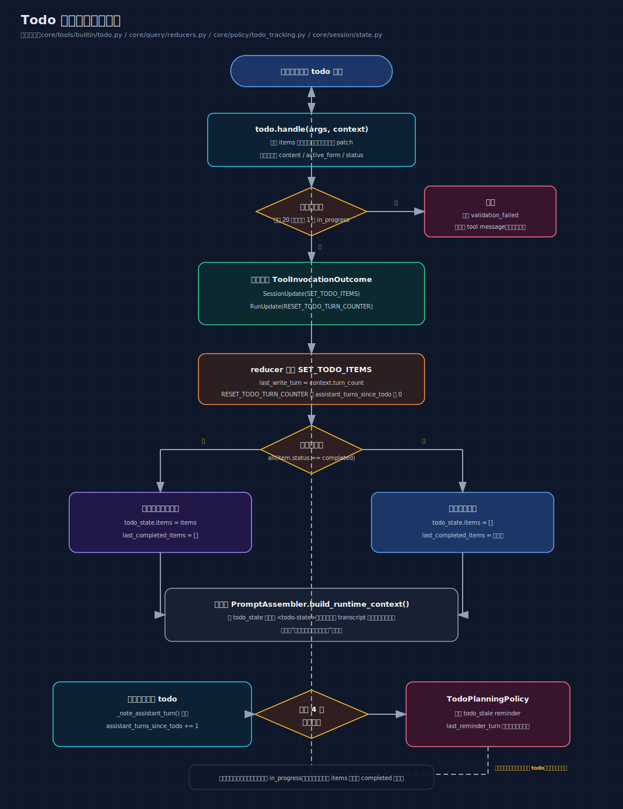

# 05: Todo System — 让 AI 管理自己的计划

> 一个没有计划的 AI 会"东一榔头西一棒子"——读了文件忘了要改什么，
> 改了代码忘了要测试。Todo System 让 AI 自己列计划、更新进度、
> 在计划过时时主动提醒自己。

---

## 你将理解什么

读完这篇，你会知道：

1. 为什么 AI 需要一个任务计划系统
2. AI 怎么创建、更新、完成计划
3. "计划过时"是什么意思，怎么检测，怎么提醒
4. 计划的真相存在哪里（为什么不是存在对话历史里）
5. 计划的数据模型和校验规则

---

## 第一个问题：没有计划的 AI 会怎样

### 场景：用户说"帮我重构 user 模块"

#### 没有计划的 AI

```text
AI： "好的，让我看看 user.py"
→ read_file("user.py")

AI： "嗯，有些函数可以优化。让我看看 auth.py"
→ read_file("auth.py")

AI： "auth 里引用了 user 的 validate 函数，我要改它"
→ edit_file("user.py", ...)   ← 改了一个函数

AI： "对了，还有 tests 也需要看看"
→ find("**/test_user*.py")

AI： "测试文件有 3 个，我先跑一个看看"
→ bash("pytest tests/test_user_model.py")

... 30 轮过去了 ...

AI： "呃，我刚才要重构什么来着？"
→ 忘了目标，开始做无关的事情
```

问题：

- 没有"要做哪些事"的全局视图
- 做了一半忘了下一步是什么
- 不知道哪些做完了，哪些还没开始
- 容易被中间结果带偏

#### 有计划的 AI

```text
AI： "好的，我先列一个重构计划"
→ todo({
     items: [
       {content: "阅读 user.py，识别需要重构的函数", status: "in_progress", ...},
       {content: "重构 validate 函数", status: "pending", ...},
       {content: "重构 serialize 函数", status: "pending", ...},
       {content: "更新 auth.py 中的调用", status: "pending", ...},
       {content: "运行测试确认无回归", status: "pending", ...},
     ]
   })

→ read_file("user.py")
→ todo({items: [1: completed, 2: in_progress, 3: pending, 4: pending, 5: pending]})

→ edit_file("user.py", ...)   ← 重构 validate
→ todo({items: [1: completed, 2: completed, 3: in_progress, 4: pending, 5: pending]})

→ edit_file("user.py", ...)   ← 重构 serialize
→ todo({items: [1: completed, 2: completed, 3: completed, 4: in_progress, 5: pending]})

→ edit_file("auth.py", ...)   ← 更新调用
→ todo({items: [1: completed, 2: completed, 3: completed, 4: completed, 5: in_progress]})

→ bash("pytest tests/")
→ todo({items: [全部 completed]})  ← 自动清空

AI： "重构完成。validate 和 serialize 函数已优化，测试全部通过。"
```

对比：

| | 没有计划 | 有计划 |
|---|---|---|
| 全局视图 | 没有，做到哪算哪 | 有，每步都能看到剩余任务 |
| 进度感知 | 不知道做了多少 | 清楚：3/5 完成 |
| 方向感 | 容易跑偏 | 目标明确 |
| 完成标准 | 不知道什么时候算完 | 全部 completed 就是完成 |

---

## 数据模型

### TodoItem — 一条任务

```python
# core/session/state.py
@dataclass(slots=True)
class TodoItem:
    content: str          # 完整描述
    active_form: str      # 简短进行时（UI 显示用）
    status: str           # "pending" / "in_progress" / "completed"
    workflow_ref: str | None = None  # 可选的步骤编号
```

为什么需要 `content` 和 `active_form` 两个字段？

```text
content（给模型看的，详细的）：
  "阅读 user.py 的 validate 函数，理解其输入输出和边界条件"

active_form（给 UI 看的，简短的）：
  "正在阅读 user.py"
```

模型看到 `content` 来理解任务细节。终端 UI 用 `active_form` 显示进度条。

三种状态：

```text
pending     → 还没开始
in_progress → 正在做（最多只能有 1 个）
completed   → 做完了
```

### TodoState — 整个计划

```python
@dataclass(slots=True)
class TodoState:
    items: list[TodoItem] = field(default_factory=list)
    last_completed_items: list[TodoItem] = field(default_factory=list)
    last_write_turn: int | None = None
    last_reminder_turn: int | None = None
```

| 字段 | 为什么需要 |
|---|---|
| `items` | 当前的任务列表 |
| `last_completed_items` | 全部完成时保留副本，用于展示"完成了 X 项"的摘要 |
| `last_write_turn` | 上次更新的轮次，用于判断是否过时 |
| `last_reminder_turn` | 上次发送过时提醒的轮次，防止同一轮重复提醒 |

为什么需要 `last_completed_items`？

```text
全部完成时：
  items → 自动清空为 []
  last_completed_items → 保留最后一份完成列表

UI 可以展示：
  "✅ 5 项任务全部完成
   - 阅读代码
   - 重构 validate
   - 重构 serialize
   - 更新调用
   - 运行测试"
```

### 先看当前实现的生命周期图



这张图里有三条最重要的线：

- `todo.handle()` 只做校验和返回 updates
- reducer 决定“全完成时清空 items，但保留 last_completed_items”
- `TodoPlanningPolicy` 通过 4 轮阈值提醒模型刷新计划

---

## Todo 工具 — 模型怎么更新计划

### Schema — 模型看到的描述

```json
{
  "name": "todo",
  "description": "重写当前会话的任务计划。每次调用必须提供完整的任务列表。",
  "input_schema": {
    "type": "object",
    "properties": {
      "items": {
        "type": "array",
        "description": "完整的任务列表（全量替换）",
        "items": {
          "type": "object",
          "properties": {
            "content": {"type": "string", "description": "完整任务描述"},
            "active_form": {"type": "string", "description": "简短进行时"},
            "status": {"type": "string", "enum": ["pending", "in_progress", "completed"]}
          },
          "required": ["content", "active_form", "status"]
        }
      }
    },
    "required": ["items"]
  }
}
```

### 关键设计：全量替换

模型每次调用 todo 工具时，必须提供**完整的任务列表**。

```text
初始计划：
  [pending: 读文件, pending: 改代码, pending: 跑测试]

完成第一步后：
  [completed: 读文件, in_progress: 改代码, pending: 跑测试]
  ↑ 注意：即使只改了一个状态，也要提供完整列表

不是这样：
  [update: item 0 → completed]  ← 不支持增量更新
```

为什么选择全量替换而不是增量更新？

1. **简单** — 不需要 diff 算法，不需要处理"添加/删除/移动"三种操作
2. **幂等** — 提交相同的列表，结果一样
3. **模型友好** — 模型只需要"想清楚当前所有任务的状态"，不需要记住"上次提交了什么"

### 当前实现里还有两个细节值得记住

1. `todo` 不只是“写计划”，它还会返回 `RESET_TODO_TURN_COUNTER`，把“连续几轮没更新计划”的计数器归零。
2. 当所有项都变成 `completed` 时，`items` 会被 reducer 清空；所以“完成态展示”不能只盯着 `items`，还要看 `last_completed_items`。

### 校验规则

```python
def _validate_items(items_data):
    # 规则 1: 最多 20 项
    if len(items_data) > 20:
        return False, "最多 20 个任务项"

    # 规则 2: 最多 1 个 in_progress
    in_progress_count = sum(1 for item in items_data if item["status"] == "in_progress")
    if in_progress_count > 1:
        return False, "最多 1 个进行中的任务"

    # 规则 3: 每项必须有 content 和 active_form
    for item in items_data:
        if not item.get("content", "").strip():
            return False, "每项必须有 content"
        if not item.get("active_form", "").strip():
            return False, "每项必须有 active_form"

    return True, None
```

为什么"最多 1 个 in_progress"？

```text
好的计划：一次只做一件事
  [completed: A, in_progress: B, pending: C, pending: D]

不好的计划：同时做多件事
  [in_progress: A, in_progress: B, in_progress: C]
  → 模型会不知道先做哪个
  → 容易在任务之间跳跃
```

### 返回的更新

```python
return ToolInvocationOutcome(
    messages=[make_tool_message(context, rendered_progress)],
    session_updates=[
        SessionUpdate(
            kind=SessionUpdateKind.SET_TODO_ITEMS,
            payload={"items": items, "last_write_turn": context.turn_count},
        ),
    ],
    run_updates=[
        RunUpdate(kind=RunUpdateKind.RESET_TODO_TURN_COUNTER, payload={}),
    ],
)
```

两个更新：

1. `SET_TODO_ITEMS` — 替换整个计划
2. `RESET_TODO_TURN_COUNTER` — 重置"连续几轮没更新 todo"的计数器

### 全部完成时的特殊处理

```python
# reducers.py 中 apply_session_update 的 SET_TODO_ITEMS 分支
all_completed = bool(items) and all(item.status == "completed" for item in items)

if all_completed:
    session_state.todo_state.items = []                      # 清空当前列表
    session_state.todo_state.last_completed_items = items    # 保留完成记录
else:
    session_state.todo_state.items = items
    session_state.todo_state.last_completed_items = []
```

```text
提交：[completed: A, completed: B, completed: C]

处理后：
  items = []               ← 清空，因为没意义停留在"全部完成"
  last_completed_items = [A, B, C]  ← 保留，用于展示摘要
```

---

## 过时检测 — 计划太久没更新怎么办

### 问题场景

```text
轮次 1: 模型制定计划 [任务1, 任务2, 任务3]
轮次 2: 模型调用 read_file（没调 todo）
轮次 3: 模型调用 edit_file（没调 todo）
轮次 4: 模型调用 bash（没调 todo）
轮次 5: 模型调用 write_file（没调 todo）

此时：计划说"任务1 是 in_progress"
      但实际上任务 1 可能早就做完了
      模型可能在做任务 3 但忘了更新计划

风险：
  模型可能重复做已经完成的任务
  或者忘了还没做的任务
```

### 解决方案：TodoPlanningPolicy

```python
# core/policy/todo_tracking.py
class TodoPlanningPolicy:
    STALE_ASSISTANT_TURNS = 4   # 4 轮没更新就提醒

    def before_model_call(self, session_state, run_state):
        # ── 检查 1: 有没有计划？ ──
        if not session_state.todo_state.items:
            return []  # 没有计划，不需要提醒

        # ── 检查 2: 是否超过阈值？ ──
        if run_state.assistant_turns_since_todo < self.STALE_ASSISTANT_TURNS:
            return []  # 还没超过 4 轮

        # ── 检查 3: 这一轮是否已经提醒过？ ──
        if session_state.todo_state.last_reminder_turn == run_state.turn_count:
            return []  # 已经提醒过了，不重复

        # ── 注入提醒 ──
        snapshot = render_snapshot(session_state.todo_state.items)
        return [{"role": "user", "content": f"<system-reminder type=\"todo_stale\">\n当前计划可能已过时，请先刷新 todo。\n{snapshot}\n</system-reminder>"}]
```

### 计数器怎么追踪

```python
# loop.py 中的 _note_assistant_turn()
def _note_assistant_turn(state, model_resp):
    """如果本轮模型没有调用 todo 工具，递增计数器"""
    tool_calls = model_resp.tool_calls or []
    called_todo = any(call.name == "todo" for call in tool_calls)

    if not called_todo:
        state.assistant_turns_since_todo += 1
```

```text
轮次 1: 模型调用 todo（制定计划）
  → assistant_turns_since_todo 不变（todo 工具会把它重置为 0）

轮次 2: 模型调用 read_file
  → 没调 todo → assistant_turns_since_todo = 1

轮次 3: 模型调用 edit_file
  → 没调 todo → assistant_turns_since_todo = 2

轮次 4: 模型调用 bash
  → 没调 todo → assistant_turns_since_todo = 3

轮次 5: 模型调用 write_file
  → 没调 todo → assistant_turns_since_todo = 4

轮次 6 开始时:
  policy 检查：4 >= 4 → 注入提醒

轮次 6: 模型看到提醒，调用 todo 更新进度
  → todo 工具返回 RESET_TODO_TURN_COUNTER
  → assistant_turns_since_todo = 0
  → 计数器重置
```

### 为什么是 4 轮而不是 1 轮

4 轮是经验值。理由：

- 有些任务天然需要多轮才能完成一步（比如读 3 个文件才能理解一个模块）
- 太频繁的提醒会打断模型的工作节奏
- 4 轮大约对应"模型已经做了不少事但还没回来更新计划"

---

## Todo 在模型输入中的渲染

每轮组装模型输入时，todo 列表被渲染到 system prompt 的 runtime context 层：

```xml
<!-- assembler.py 中 _render_todo_state() 生成的 -->
<runtime-context>
  <environment>
    工作目录: /home/user/project
    日期: 2026-04-25
  </environment>

  <active-skills>...</active-skills>

  <todo-state>
    <item status="completed">阅读 user.py 的现有实现</item>
    <item status="in_progress">重构 validate 函数</item>
    <item status="pending">重构 serialize 函数</item>
    <item status="pending">更新 auth.py 中的调用</item>
    <item status="pending">运行测试确认无回归</item>
  </todo-state>

  <file-runtime>...</file-runtime>
</runtime-context>
```

### 关键点：这是每轮重建的

```text
旧消息里的 todo:
  [user: "计划: [A, B, C]"]    ← 轮次 1 的消息
  [user: "计划: [A, ✓B, C]"]   ← 轮次 5 的消息
  ...这些消息可能因为 compact 被删除

runtime context 里的 todo:
  <todo-state>                  ← 每轮从 SessionState.todo_state 重建
    <item status="in_progress">B</item>
    <item status="pending">C</item>
  </todo-state>
  ↑ 即使旧消息被删除，这里仍然是正确的
```

这就是"显式状态"和"对话历史"的区别。计划的真相在 `SessionState.todo_state` 里，不依赖对话历史中是否还保留着某条旧消息。

---

## 完整流程示例

```text
用户： "帮我重构 user 模块的错误处理"

── 轮次 1 ──
模型想："先了解任务范围，列一个计划"
模型输出 tool_calls: [todo({...}), read_file("user.py")]

分区：todo(写入) 串行, read_file(只读) → 但 todo 先执行
  todo → SET_TODO_ITEMS([
    {content: "阅读 user.py 错误处理代码", status: "in_progress", active_form: "正在阅读 user.py"},
    {content: "识别需要重构的 try/except 块", status: "pending", active_form: "正在识别需要重构的代码"},
    {content: "重构错误处理逻辑", status: "pending", active_form: "正在重构错误处理"},
    {content: "运行测试", status: "pending", active_form: "正在运行测试"},
  ])
  RESET_TODO_TURN_COUNTER

  read_file → 返回 user.py 内容 + UPSERT_FILE_STATE

模型看到：
  tool result: "计划已创建（4 项任务）"
  tool result: "user.py 的内容是..."

turn_count = 1, assistant_turns_since_todo = 0
transition = NEXT_TURN

── 轮次 2 ──
模型想："我已经看了文件，发现 3 个 try/except 块需要重构"
模型输出 tool_calls: [todo({更新进度}), edit_file(...)]

  todo → SET_TODO_ITEMS([
    {status: "completed", content: "阅读 user.py..."},
    {status: "completed", content: "识别 try/except 块"},
    {status: "in_progress", content: "重构错误处理"},
    {status: "pending", content: "运行测试"},
  ])

  edit_file → 替换 try/except 为更好的错误处理

模型看到：计划更新成功 + 文件修改成功
turn_count = 2, assistant_turns_since_todo = 0

── 轮次 3 ──
模型想："重构完成了，跑测试"
模型输出 tool_calls: [bash("pytest"), todo({更新进度})]

  bash → 返回测试结果（全部通过）
  todo → SET_TODO_ITEMS([全部 completed])
  → items 自动清空，last_completed_items 保留

turn_count = 3

── 轮次 4 ──
模型想："任务完成了，回复用户"
模型输出 content: "重构完成！修改了 3 个 try/except 块，测试全部通过。"
→ 命中分支 C，正常结束
```

---

## 常见疑问

### Q: 模型会不会忘记调用 todo 工具？

A: 会。这就是为什么有过时检测——如果 4 轮没更新，系统会主动提醒。但模型不是每次都会听从提醒，这是 LLM 的固有限制。

### Q: 为什么限制最多 20 项？

A: 太长的计划对模型没有帮助。模型很难跟踪超过 20 个任务的状态。如果任务很多，应该拆成多个阶段，每个阶段一个独立的计划。

### Q: 如果模型多次制定不同的计划怎么办？

A: 全量替换的设计让这个问题自然解决。每次调用 todo 工具，旧计划就被新计划完全覆盖。模型可以自由调整计划。

### Q: todo 状态能跨对话保持吗？

A: 当前不能。`SessionState` 在程序退出后不持久化。如果需要跨会话保持，需要把状态保存到文件或数据库。

---

## 关键文件索引

| 文件 | 职责 | 行数 |
|---|---|---|
| `core/tools/builtin/todo.py` | todo 工具 handler（校验 + 返回更新） | ~190 行 |
| `core/session/state.py` | `TodoItem`, `TodoState` 数据模型 | ~40 行 |
| `core/policy/todo_tracking.py` | `TodoPlanningPolicy` 过时检测 | ~35 行 |
| `core/query/reducers.py` | `SET_TODO_ITEMS` 的 reducer 逻辑 | reducer 中约 10 行 |
| `core/prompt/assembler.py` | `_render_todo_state()` 渲染到 system prompt | 约 20 行 |
| `core/query/loop.py` | `_note_assistant_turn()` 计数器追踪 | 约 15 行 |

---

## 一句话记住

**Todo System 的关键不只是“让模型列计划”，而是把计划做成显式状态：全量替换、单焦点执行、完成后保留摘要、过时后自动提醒。**
