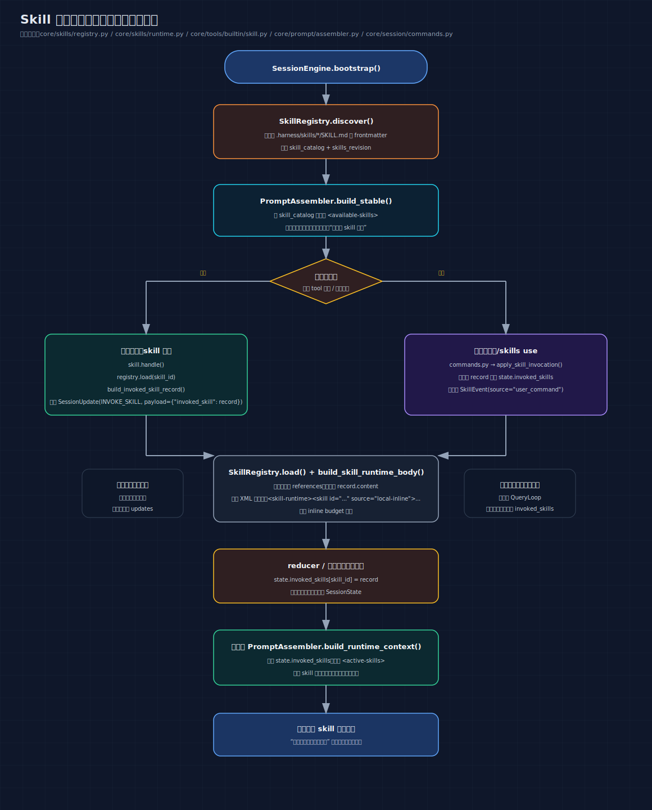

# 06: Skill System — 给 AI 加载专业能力

> 基础模型是一个通才——什么都知道一点，但不是任何领域的专家。
> Skill System 让 AI 在需要时加载专业指令和参考文件，
> 从一个"通才"变成带"专业手册"的"专家"。

---

## 你将理解什么

读完这篇，你会知道：

1. 什么是 skill，为什么 AI 需要它
2. skill 的文件结构怎么组织
3. 系统怎么发现 skill、怎么加载 skill、怎么注入到模型输入
4. 为什么 skill 是"渐进式加载"的（不是启动时全部加载）
5. skill 的内容怎么进入模型的 system prompt，为什么每轮都要重建

---

## 第一个问题：AI 为什么需要 skill

### 没有 skill 的 AI

```text
你： "帮我做一份季度销售分析报告"

AI： "好的，请问：
  1. 你们公司的指标定义是什么？（GMV 包含退款吗？）
  2. 报告格式有什么要求？
  3. 数据维度有哪些？
  4. 需要对比什么时间段？
  ..."
```

AI 什么都不知道，需要你手把手教。每次做一个任务都要从头解释。

### 有 skill 的 AI

```text
你： "帮我做一份季度销售分析报告"

AI： → 先加载 "analysis-report" skill
     → skill 里有：工作流程、公司指标定义、报告模板

AI： "按照工作流程开始分析。
     注意到 GMV 定义为总交易额（含退款），
     增长率使用同比口径..."
→ 直接按流程开始工作
```

区别：

| | 没有 skill | 有 skill |
|---|---|---|
| 效率 | 每次都要问用户 | 直接开始工作 |
| 一致性 | 每次可能做法不同 | 按同一份手册做事 |
| 质量 | 依赖用户的解释质量 | 专业指令保证质量 |
| 本质 | 临时工（什么都不懂） | 带培训材料的新员工 |

---

## Skill 的文件结构

### 目录组织

每个 skill 是 `.harness/skills/` 目录下的一个子目录：

```text
你的项目/
  .harness/
    skills/
      analysis-report/            ← 一个 skill
        SKILL.md                  ← 主文件（必须有）
        metrics_definition.md     ← 参考文件（可选）
        report_template.md        ← 参考文件（可选）

      code-review/                ← 另一个 skill
        SKILL.md
        review_checklist.md

      test-writer/                ← 第三个 skill
        SKILL.md
        test_patterns.md
        assertion_examples.md
```

### SKILL.md 的格式

```markdown
---
name: Analysis Report
description: 生成数据分析报告
when-to-use: 当用户要求生成数据分析报告时使用此 skill
references:
  - path: metrics_definition.md
    purpose: 公司指标定义
  - path: report_template.md
    purpose: 报告模板
---

## 工作流程

1. 确认数据来源和时间范围
2. 使用 bash 工具运行数据清洗脚本
3. 按 metrics_definition.md 中的口径计算指标
4. 按 report_template.md 的格式生成报告

## 分析规则

- 所有金额单位统一为万元
- 增长率使用同比口径（与去年同期对比）
- 异常值定义：偏离均值超过 2 个标准差
- 缺失数据处理：标记但不删除，在报告中说明

## 输出格式

使用 report_template.md 中的模板，包含：
- 执行摘要（200 字以内）
- 关键指标表
- 趋势分析
- 建议
```

分两部分：

- **YAML frontmatter**（`---` 之间）：元数据
  - `name`：显示名称
  - `description`：简短描述
  - `when-to-use`：什么场景下使用
  - `references`：参考文件列表（路径 + 用途说明）

- **正文**（`---` 之后）：完整的专业指令
  - 工作流程
  - 规则和约束
  - 输出格式要求
  - 任何模型需要知道的专业知识

---

## 四层数据模型

Skill 的数据在系统中有四种形态：

```text
SkillMeta          → 轻量元数据（发现阶段）
                     只读 frontmatter，不读正文
                     用途：告诉模型"你可以用这些 skill"

SkillContent       → 完整内容（加载阶段）
                     frontmatter + 正文 + 所有参考文件
                     用途：渲染成模型能看到的格式

InvokedSkillRecord → 激活记录（运行时）
                     渲染好的 XML 字符串
                     用途：注入到 system prompt

SkillEvent         → 审计日志
                     记录何时激活、何时重载等事件
                     用途：调试和审计
```

### SkillMeta

```python
@dataclass(slots=True)
class SkillMeta:
    skill_id: str           # "analysis-report"
    name: str               # "Analysis Report"
    description: str        # "生成数据分析报告"
    when_to_use: str        # "当用户要求生成..."
    skill_dir: Path         # skill 目录的路径
    skill_file: Path        # SKILL.md 的路径
    references: list[SkillReference]  # 参考文件列表
```

### SkillContent

```python
@dataclass(slots=True)
class SkillContent:
    meta: SkillMeta
    body: str                    # SKILL.md 的正文
    content_digest: str          # SHA256 哈希（用于缓存验证）
    reference_bodies: dict[str, str]  # 参考文件名 → 内容
```

### InvokedSkillRecord

```python
@dataclass(slots=True)
class InvokedSkillRecord:
    skill_id: str
    skill_path: str
    content_digest: str
    content: str          # 渲染好的 <skill-runtime> XML
    invoked_at_turn: int  # 在第几轮激活的
```

为什么需要这四层？因为**加载是渐进式的**：

| 阶段 | 什么时候 | 加载什么 | 成本 |
|---|---|---|---|
| 启动 | 程序启动时 | 只读 frontmatter | 很低 |
| 激活 | 模型调用 skill 工具时 | 正文 + 参考文件 | 较高 |
| 运行 | 每轮循环 | 渲染 XML 到 prompt | 每轮都做 |

如果启动时就把所有 skill 的完整内容都加载进来，万一有很多 skill 就会浪费资源。按需加载才是正确的做法。

### 先看一张从发现到生效的时序图



这张图最关键的是最后两步：

- skill 激活写进 `SessionState.invoked_skills`
- 下一轮 `build_runtime_context()` 才把它真正渲染进模型输入

也就是说，当前 skill 机制的真实语义是：**本轮激活，下一轮生效。**

---

## 两阶段发现与加载

### 阶段 1：discover — 启动时扫描元数据

```python
# core/skills/registry.py
def discover(self, skills_dir) -> dict[str, SkillMeta]:
    """扫描 skills_dir 下的所有 SKILL.md，只解析 frontmatter"""
    catalog = {}
    for skill_dir in skills_dir.iterdir():
        skill_file = skill_dir / "SKILL.md"
        if skill_file.exists():
            meta = self._parse_skill_markdown(skill_file)
            catalog[meta.skill_id] = meta
    return catalog
```

```text
.harness/skills/
  analysis-report/SKILL.md  → 解析 frontmatter → SkillMeta(skill_id="analysis-report", ...)
  code-review/SKILL.md      → 解析 frontmatter → SkillMeta(skill_id="code-review", ...)
  test-writer/SKILL.md      → 解析 frontmatter → SkillMeta(skill_id="test-writer", ...)

结果：catalog = {
  "analysis-report": SkillMeta(...),
  "code-review": SkillMeta(...),
  "test-writer": SkillMeta(...),
}
```

这个 catalog 存入 `SessionState.skill_catalog`，然后被渲染到 system prompt 的 stable 层：

```xml
<!-- 模型在每轮都能看到 -->
<available-skills>
  <skill id="analysis-report">生成数据分析报告</skill>
  <skill id="code-review">代码审查</skill>
  <skill id="test-writer">编写测试用例</skill>
</available-skills>
```

模型看到这份列表后，知道"我可以用这些 skill"，然后决定要不要用。

### 阶段 2：load — 按需加载完整内容

```python
def load(self, skill_id: str) -> SkillContent:
    """按需加载 skill 的完整内容和参考文件"""
    # 1. 读 SKILL.md 的正文
    # 2. 读 frontmatter 中声明的 references
    #    如果 frontmatter 没声明 references，自动发现目录下的所有 .md 文件
    # 3. 缓存结果（同一个 skill 只加载一次）
```

只在模型调用 skill 工具时才执行。

### 参考文件的发现

```text
情况 1：frontmatter 明确声明了 references
  references:
    - path: metrics_definition.md
      purpose: 公司指标定义
    - path: report_template.md
      purpose: 报告模板
  → 只加载这两个文件

情况 2：frontmatter 没有声明 references
  → 自动发现 skill 目录下的所有 .md 文件（排除 SKILL.md 本身）
  → 全部加载
```

### 缓存机制

skill 的 stable context 部分（框架指令 + skill catalog）按 `skills_revision` 缓存：

```python
def compute_skills_revision(skills_dir):
    """计算所有 SKILL.md 的修改时间哈希"""
    revision = ""
    for skill_file in sorted(skills_dir.glob("*/SKILL.md")):
        revision += str(skill_file.stat().st_mtime)
    return hashlib.sha256(revision.encode()).hexdigest()[:16]
```

如果 skill 文件没有变化，stable context 可以复用缓存，不用重新渲染。

---

## Skill 工具 — 模型怎么激活 skill

### 模型调用过程

```text
模型看到 available-skills 列表
→ 决定使用 "analysis-report"
→ 返回 tool_calls: [{"name": "skill", "args": {"skill": "analysis-report"}}]
```

### 工具处理流程

```python
# core/tools/builtin/skill.py
def handle(args, context) -> ToolInvocationOutcome:
    skill_id = args.get("skill", "").strip()

    # 1. 参数校验
    if not skill_id:
        return ToolInvocationOutcome(status=FAILURE, error="missing_params", ...)

    # 2. 检查 skill 是否存在
    state = context.session_state
    if skill_id not in state.skill_catalog:
        return ToolInvocationOutcome(status=FAILURE, error="not_found", ...)

    # 3. 加载完整内容
    registry = context.skill_registry
    content = registry.load(skill_id)

    # 4. 构建激活记录（渲染成 XML）
    record = build_invoked_skill_record(
        state=state,
        skill_id=skill_id,
        content=content,
        turn=context.turn_count,
    )

    # 5. 返回结果
    return ToolInvocationOutcome(
        messages=[make_tool_message(context,
            f"Skill loaded: {skill_id}. The skill guidance will be available on the next model turn."
        )],
        session_updates=[
            SessionUpdate(kind=INVOKE_SKILL, payload={"invoked_skill": record}),
            SessionUpdate(kind=APPEND_SKILL_EVENT, payload={"skill_event": SkillEvent(...)}),
        ],
    )
```

注意：工具**不直接修改** `session_state.invoked_skills`。它返回一个 `INVOKE_SKILL` 更新，由 reducer 统一应用。

---

## Skill 如何渲染成 XML

### build_skill_runtime_body()

```python
# core/skills/runtime.py
def build_skill_runtime_body(skill_id: str, content: SkillContent) -> str:
    """把 skill 内容渲染成 <skill-runtime> XML"""
    parts = ["<skill-runtime>"]

    parts.append(f'  <skill id="{skill_id}" source="local-inline">')
    parts.append(f"    Base directory for this skill: {content.meta.skill_dir}")
    parts.append("    <instruction>")
    parts.append(content.body)
    parts.append("    </instruction>")

    if content.reference_bodies:
        parts.append("    <reference-files>")
        for path, body in content.reference_bodies.items():
            parts.append(f'      <file path="{path}">')
            parts.append(body)
            parts.append("      </file>")
        parts.append("    </reference-files>")
    parts.append("  </skill>")
    parts.append("</skill-runtime>")
    return "\n".join(parts)
```

渲染结果举例：

```xml
<skill-runtime>
  <skill id="analysis-report" source="local-inline">
    Base directory for this skill: /home/user/project/.harness/skills/analysis-report
    <instruction>
      ## 工作流程
      1. 确认数据来源和时间范围
      2. 使用 bash 工具运行数据清洗脚本
      ...
    </instruction>

    <reference-files>
      <file path=".harness/skills/analysis-report/metrics_definition.md">
        # 公司指标定义
        ...
      </file>
      <file path=".harness/skills/analysis-report/report_template.md">
        # 季度分析报告模板
        ...
      </file>
    </reference-files>
  </skill>
</skill-runtime>
```

### 预算控制

```python
MAX_INLINE_SKILL_CHARS = 500_000  # 50 万字符

def ensure_inline_skill_budget(*, state, new_content: str, max_chars: int = 500_000):
    total = sum(len(record.content) for record in state.invoked_skills.values())
    if total + len(new_content) > max_chars:
        raise ValueError(
            f"Inline skill budget exceeded: {total + len(new_content)} > {max_chars}"
        )
```

防止同时激活太多 skill 把上下文窗口撑爆。

---

## Skill 如何进入模型输入

### 激活前

模型在 stable context 的 `<available-skills>` 里看到 skill 列表（只有 ID 和描述）：

```xml
<!-- PromptAssembler.build_stable() 生成的 -->
<available-skills>
  <skill id="analysis-report">生成数据分析报告</skill>
  <skill id="code-review">代码审查</skill>
</available-skills>
```

### 激活后

`PromptAssembler.build_runtime_context()` 每轮会读取 `session_state.invoked_skills`，把已激活 skill 的完整内容注入 system prompt：

```xml
<!-- PromptAssembler.build_runtime_context() 生成的 -->
<runtime-context>
  <environment>
    工作目录: /home/user/project
    日期: 2026-04-25
  </environment>

  <active-skills>
    <active-skill id="analysis-report">
      <skill-runtime>
        <instruction>
          ## 工作流程
          1. 确认数据来源...
          ...
        </instruction>
        <reference-files>
          <file path=".harness/skills/analysis-report/metrics_definition.md">...</file>
          <file path=".harness/skills/analysis-report/report_template.md">...</file>
        </reference-files>
      </skill-runtime>
    </active-skill>
  </active-skills>

  <todo-state>...</todo-state>
  <file-runtime>...</file-runtime>
</runtime-context>
```

### 关键：这是每轮重建的

```text
不是这样：
  轮次 1: 注入一条消息 "skill 已加载，内容是..."
  轮次 2-100: 依赖那条消息还在对话历史里

而是这样：
  每轮开始时：
    读取 session_state.invoked_skills
    渲染成 <active-skills> XML
    放入 system prompt 的 runtime-context 层

  即使轮次 1 的消息被 compact 删掉了，
  轮次 100 的 system prompt 仍然包含完整的 skill 内容
```

这就是"显式状态"的威力——skill 的真相存在 `SessionState.invoked_skills` 里，不依赖对话历史。

---

## Skill 的完整生命周期

```text
程序启动
  │
  ▼
discover()
  │  扫描 .harness/skills/*/SKILL.md
  │  只读 frontmatter（name, description, references）
  │
  ▼
catalog = {"analysis-report": SkillMeta(...), ...}
  │
  ▼
渲染 <available-skills> 到 system prompt（stable 层）
  │
  │  模型看到："你可以用这些 skill"
  │
  ▼
模型决定使用 "analysis-report"
  │  返回 tool_calls: [{"name": "skill", "args": {"skill": "analysis-report"}}]
  │
  ▼
skill 工具执行
  │  1. 验证 skill_id 存在于 catalog
  │  2. registry.load("analysis-report")  ← 读正文 + 参考文件
  │  3. build_invoked_skill_record()       ← 渲染成 XML
  │  4. 检查预算（总内容不超过 500K 字符）
  │  5. 返回 ToolInvocationOutcome
  │     ├─ messages: "Skill loaded: analysis-report"
  │     ├─ session_updates: INVOKE_SKILL(invoked_skill=record)
  │     └─ session_updates: APPEND_SKILL_EVENT(audit)
  │
  ▼
reducer 应用 INVOKE_SKILL 更新
  │  session_state.invoked_skills["analysis-report"] = record
  │
  ▼
下一轮开始
  │
  ▼
build_runtime_context() 读取 invoked_skills
  │
  ▼
完整的 <active-skills> XML 出现在 system prompt 中
  │  模型看到完整的 skill 指令和参考文件
  │
  ▼
模型按 skill 指令工作
  │
  ▼
skill 持续生效，直到会话结束
  （每轮都从 session_state 读取并重建）
```

---

## 用户也可以手动激活

除了模型调用 skill 工具，用户也可以通过命令行：

```text
>> /skills list
  analysis-report  - 生成数据分析报告
  code-review      - 代码审查
  test-writer      - 编写测试用例

>> /skills use analysis-report
  Loaded skill inline: analysis-report
```

这条命令走的是 `core/session/commands.py`，通过 `apply_skill_invocation()` 直接把 record 写进 `state.invoked_skills`。
另外命令执行时还会打印一条彩色日志，形如：

```text
[Skill] 激活 analysis-report (...)
```

---

## 常见疑问

### Q: skill 和 prompt 的区别是什么？

A: skill 是一种特殊的、结构化的 prompt。普通的 prompt 是"一问一答"，skill 是"加载后持续生效的专业指令"。skill 还有参考文件、预算控制、审计日志等机制，比简单的 prompt 更结构化。

### Q: 一个 skill 能引用另一个 skill 吗？

A: 当前不支持。skill 是独立的，不能组合。如果需要组合能力，可以把组合逻辑写在另一个 skill 里。

### Q: skill 激活后可以停用吗？

A: 当前 inline 激活的 skill 不能从已有历史中停用。`/skills off` 命令目前只会提示“如果需要干净上下文，请开启新 session”，不会从 `invoked_skills` 中删除记录。

### Q: 如果 skill 内容太长怎么办？

A: 有 50 万字符的预算限制。如果超出，`ensure_inline_skill_budget()` 会报错，skill 不会被激活。设计上应该控制 skill 内容的长度。

### Q: 为什么不把所有 skill 都在启动时加载？

A: 性能考虑。如果有 20 个 skill，每个有 3 个参考文件，启动时就要读 80 个文件。但实际上用户可能只用 1-2 个。按需加载更高效。

---

## 关键文件索引

| 文件 | 职责 | 行数 |
|---|---|---|
| `core/skills/models.py` | 数据模型（SkillMeta, SkillContent, InvokedSkillRecord, SkillEvent） | ~50 行 |
| `core/skills/registry.py` | 两阶段发现和加载（discover + load） | ~230 行 |
| `core/skills/runtime.py` | XML 渲染、预算控制、record 构建 | ~100 行 |
| `core/tools/builtin/skill.py` | skill 工具 handler | ~120 行 |
| `core/prompt/assembler.py` | 渲染到 system prompt（`<available-skills>` 和 `<active-skills>`） | 相关方法约 50 行 |
| `core/session/commands.py` | `/skills` 命令行命令 | ~80 行 |

---

## 一句话记住

**Skill System 的关键不是“把一段 prompt 塞给模型”，而是把 skill 做成可发现、可按需加载、可跨轮持久、并在下一轮稳定生效的运行时能力。**
