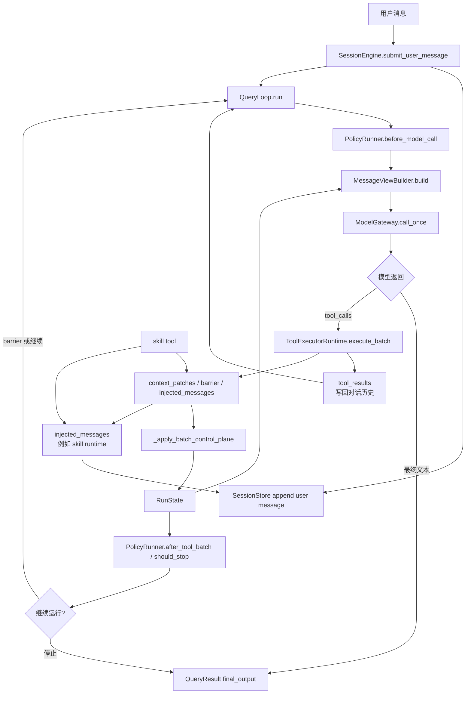

# 阶段 4 设计意图讲解：Control Plane、Policy、Skills 为什么让 Agent 变聪明

> 面向想学习 Agent 智能体开发的初级工程师。本文不只是描述“有哪些模块”，而是解释阶段 4 为什么必须这样设计、这些机制在真实代码里如何协作、以及当前实现已经做到什么程度。

---

## 1. 先用一句话理解阶段 4

阶段 4 的目标，不是单纯把 `AgentLoop` 拆成更多文件，而是把一个“不断膨胀的主循环”，重构成：

- 一个稳定的执行内核
- 若干可插拔的横切机制
- 一套能让工具结果反过来影响执行流程的控制方式

如果要更具体一点，可以这样说：

> 阶段 4 让 Harness 从“模型调工具的对话循环”，演化成“带运行状态、策略钩子、技能注入和控制信号”的 Agent 运行时。

---

## 2. 阶段 4 之前，系统卡在哪里

如果你只从功能角度看，阶段 3 其实已经能工作了：

- 能接收用户消息
- 能调模型
- 能调用工具
- 能运行子 Agent

问题不在于“不能用”，而在于“很难继续优雅地扩展”。

当系统开始长出这些需求时，原先的单循环结构会明显吃力：

1. 某些工具执行后，不只是返回文本，还应该改变后续运行方式。
2. 某些约束不是任务本身的一部分，而是所有任务都会遇到的运行规则。
3. 某些能力不应该每次都改代码硬接进去，而应该像“外挂能力包”一样按需加载。

阶段 4 的三个关键设计，正好分别解决这三个问题：

- `control plane` 解决“工具如何影响循环行为”
- `policy system` 解决“横切规则如何不污染主循环”
- `skills system` 解决“能力如何按需扩展，而不是硬编码”

---

## 3. 阶段 4 的核心骨架

阶段 4 最重要的边界，不是“拆了多少包”，而是谁负责稳定骨架，谁负责变化点。

### 3.1 稳定骨架：SessionEngine + QueryLoop

会话入口在 [`core/session/engine.py`](../core/session/engine.py)。

- [`SessionEngine.bootstrap()`](../core/session/engine.py#L55-L67) 负责启动时发现 skills、构造稳定系统提示、注入环境消息。
- [`SessionEngine.submit_user_message()`](../core/session/engine.py#L93-L107) 负责接收用户输入，然后把一次 query 的执行交给 `QueryLoop.run()`。

真正的循环内核在 [`core/query/loop.py`](../core/query/loop.py#L154-L260)。

把 `QueryLoop.run()` 读成白话，其实就是：

1. 先让 policy 有机会在调模型前插入提醒
2. 构造当前消息视图和可用工具列表
3. 调模型
4. 如果模型返回工具调用，就执行工具
5. 把工具结果回写到消息历史和运行状态
6. 决定是继续循环，还是输出最终文本

这就是阶段 4 想保住的“稳定内核”。

### 3.2 变化点：RunState

不同机制之间不是互相直接调用，而是通过 `RunState` 协作。定义在 [`core/query/state.py`](../core/query/state.py#L10-L28)。

这里几个字段特别关键：

- `allowed_tools_override`
- `model_override`
- `effort_override`
- `barrier_reason`
- `todo_replan_required`
- `assistant_turns_since_todo`

初学者可以把 `RunState` 理解成：

> 一次 query 运行中的“共享黑板”。

谁都不需要直接控制别人，只需要把信号写到黑板上；其他模块在下一步读取黑板即可。

### 3.3 阶段 4 运行时协作图

下面这张图可以先建立一个整体感觉，再回头读后面的 `control plane`、`policy` 和 `skills` 细节：



如果用一句话概括这张图：

> `SessionEngine` 负责把一次用户输入送进运行时，`QueryLoop` 负责主循环，`ToolExecutorRuntime` 负责执行工具，而 `RunState` 负责让 control plane、policy 和 view builder 通过状态协作。

---

## 4. Control Plane 到底是什么

这是阶段 4 最值得学、也最容易被说空的概念。

### 4.1 先看传统写法有什么问题

很多 Agent 的工具调用模型是这样的：

```text
模型决定调工具
-> 工具执行
-> 返回字符串
-> 模型继续看字符串
```

这种写法能工作，但有个明显局限：

工具只是“数据提供者”，它不能优雅地表达“我执行完之后，你应该换一种运行方式”。

但真实系统里经常会遇到这种需求：

- 激活某个 skill 后，应该立刻重新思考下一步
- 某个工具结果会缩小后续可用工具集
- 某个工具结果会建议切换模型或推理强度

如果没有单独的控制层，你最后通常会在主循环里堆满 `if tool == xxx` 的特判。

### 4.2 阶段 4 的做法：让工具返回“控制信号”

Harness 在 [`core/tools/context.py`](../core/tools/context.py#L9-L37) 里把工具返回值设计成了两层：

- 普通输出：`output`
- 控制信号：`injected_messages`、`context_patch`、`barrier`

关键数据结构：

- [`ContextPatch`](../core/tools/context.py#L9-L13)：表示运行时参数修改
- [`ExecutionBarrier`](../core/tools/context.py#L16-L19)：表示执行屏障
- [`ToolResult`](../core/tools/context.py#L27-L37)：统一工具结果

这就是 control plane 的本质：

> 工具不只返回“内容”，还返回“接下来系统该怎么跑”的信号。

### 4.3 它为什么叫 plane

因为这里其实有两条并行的数据流：

- `data plane`：给模型看的工具输出文本
- `control plane`：给运行时看的控制信号

在 [`ToolExecutorRuntime.execute_batch()`](../core/tools/runtime.py#L72-L142) 里，你能看到这两个面是分开收集的：

- `tool_results` 会进入对话历史，成为模型看到的 `tool` 消息
- `injected_messages` / `context_patches` / `barrier` 会被聚合进 `ToolBatchResult`

所以这里的“plane”不是玄学名词，它只是表示：

> 同一次工具执行，既有内容流，也有控制流。

### 4.4 当前代码里，control plane 真正落地到什么程度

这里要讲严谨一点。

当前实现里，control plane 的抽象已经建好了，但真正打通的主路径并不多。

已经真实生效的能力：

- `skill` 工具返回 `injected_messages`
- `skill` 工具返回 `ExecutionBarrier(reason="skill_expanded")`
- `QueryLoop` 读取这个 barrier，设置 `todo_replan_required = True`

对应代码：

- [`core/tools/builtin/skill.py`](../core/tools/builtin/skill.py#L42-L76)
- [`core/query/loop.py`](../core/query/loop.py#L110-L141)

目前更多还是“架构预留”的能力：

- `ContextPatch.allowed_tools`
- `ContextPatch.model_override`
- `ContextPatch.effort_override`

这些字段确实存在，也会被写入 `RunState`，见 [`_apply_batch_control_plane()`](../core/query/loop.py#L110-L141)；但当前仓库里几乎没有工具真正返回 `context_patch`，而且 `ModelGateway.call_once()` 也没有消费 `model_override` / `effort_override`，见 [`core/llm/client.py`](../core/llm/client.py#L14-L31)。

所以如果你自己对外讲，最准确的说法应该是：

> 阶段 4 已经把 control plane 设计成通用机制，但当前真正上线跑通的典型案例，主要是 `skill_expanded` 这条链路。

---

## 5. 一个真实案例：skill -> barrier -> replan

这是当前阶段 4 最完整、最值得拿来教学的案例。

假设模型当前任务是：

> “请用 TDD 的方式实现一个功能”

而模型先决定调用 `skill("tdd")`。

### 5.1 第一步：skill 被发现，但不会在启动时全文注入

启动时只是 catalog discovery，不是全文加载。

入口在 [`SessionEngine.bootstrap()`](../core/session/engine.py#L55-L67)，它会调用 [`SkillRegistry.discover()`](../core/skills/registry.py#L105-L146) 扫描 `.harness/skills/*/SKILL.md`，把这些技能的元信息放进 `SessionState.skill_catalog`。

这一步只做：

- 发现有哪些 skill
- 记录 name / description / when-to-use / references

不会把 skill 正文全塞进 prompt。

这很重要，因为它说明阶段 4 不是“把所有技能预装进系统提示”，而是“先告诉模型有哪些能力可用，再按需加载”。

### 5.2 第二步：模型调用 skill 工具

真正加载 skill 的逻辑在 [`core/tools/builtin/skill.py`](../core/tools/builtin/skill.py#L42-L76)。

这段代码做了三件事：

1. 用 `registry.load(skill_id)` 懒加载 skill 正文和引用文件
2. 调用 [`apply_skill_invocation()`](../core/skills/runtime.py#L35-L45)，构造 `<skill-runtime>` system message
3. 返回一个带 `injected_messages` 和 `barrier` 的 `ToolResult`

这个返回值不是普通“工具执行成功”而已，它实际上在说：

- 把 skill 内容插进上下文
- 当前这批工具到这里先停
- 让模型重新看一眼更新后的世界，再决定下一步

### 5.3 第三步：skill 内容被真正注入上下文

注入格式在 [`build_skill_runtime_message()`](../core/skills/runtime.py#L6-L22)：

```xml
<skill-runtime>
  <skill id="..." source="local-inline">
    <instruction>...</instruction>
    <reference-files>...</reference-files>
  </skill>
</skill-runtime>
```

这一步的设计意图是：

> skill 不是代码级插件，而是运行时注入的高优先级提示片段。

同时还有一个很实际的保护机制：[`ensure_inline_skill_budget()`](../core/skills/runtime.py#L25-L32) 会限制所有内联 skill 的总字符数，避免上下文被技能文件无限膨胀。

### 5.4 第四步：barrier 触发控制平面

`QueryLoop` 在工具执行完后会调用 [`_apply_batch_control_plane()`](../core/query/loop.py#L110-L141)。

当它看到 `batch.barrier.reason == "skill_expanded"` 时，会做两件事：

- `state.todo_replan_required = True`
- `state.todo_replan_reason = "skill_expanded"`

这就是 control plane 真正落地的瞬间。

注意，这里没有发生：

- skill 工具直接去调 policy
- skill 工具直接改 view builder
- skill 工具直接让模型重跑

它只是返回信号，主循环统一解释这个信号。

这就是设计上的优雅之处。

### 5.5 第五步：Policy 接手，提醒模型刷新 todo

接下来，下一轮模型调用前，`PolicyRunner.before_model_call()` 会被触发，见 [`core/policy/base.py`](../core/policy/base.py#L17-L38)。

而 [`TodoPlanningPolicy.before_model_call()`](../core/policy/todo_tracking.py#L7-L36) 会检查：

- 如果 `run_state.todo_replan_required` 为真
- 就注入一条 `<system-reminder type="post_skill_replan">...`

也就是说，control plane 负责把“系统状态”改掉，policy 负责把“状态变化”翻译成模型能理解的提醒消息。

### 5.6 这条链路为什么值得学习

因为它体现了阶段 4 最核心的思想：

- tool 不直接操纵 loop
- policy 不直接操纵 tool
- skill 不直接操纵 policy

它们通过 `ToolResult -> ToolBatchResult -> RunState -> Policy` 这条数据链协作。

对于初学者，这是一个非常重要的架构启发：

> 当系统变复杂后，不要急着让模块互相调用，先想能不能通过状态和事件来解耦。

---

## 6. Policy System：为什么不是“把判断塞进 QueryLoop”

Policy 的定义在 [`core/policy/base.py`](../core/policy/base.py#L6-L38)。

接口很简单：

- `before_model_call()`
- `after_tool_batch()`
- `should_stop()`

这三个钩子很像给主循环留出的“三个插口”：

- 调模型前能不能加提醒
- 工具批执行后能不能追加处理
- 当前是不是该停了

### 6.1 当前已有的两个 policy

#### MaxTurnsPolicy

定义在 [`core/policy/max_turns.py`](../core/policy/max_turns.py#L4-L17)。

它的职责非常纯粹：

- 不负责注入消息
- 不负责处理工具结果
- 只负责在 `state.turn_count >= max_turns` 时返回 `"max_turns"`

这类 policy 可以理解为“裁判型策略”。

#### TodoPlanningPolicy

定义在 [`core/policy/todo_tracking.py`](../core/policy/todo_tracking.py#L4-L42)。

它主要做两件事：

1. skill 刚展开后，提醒模型刷新 todo
2. 如果 todo 已经存在，但助手很多轮都没碰 todo，再提醒它计划可能过时

这类 policy 可以理解为“教练型策略”。

### 6.2 为什么 policy 比在 loop 里堆 if 更好

因为有很多逻辑并不是“业务主线”，而是“运行时规则”：

- 最多跑几轮
- 多久没更新计划要提醒
- 将来可能还会加 token 预算、审计、安全限制

这些规则如果全写进 `QueryLoop.run()`，主循环会快速膨胀。

policy system 的价值不是“看起来更面向对象”，而是：

> 它强迫你承认有些逻辑是横切关注点，不该和主流程搅在一起。

### 6.3 但也要讲清楚它现在的边界

当前 harness 的 policy system 已经有雏形，但还不算“完全吃掉横切逻辑”。

例如下面这些事情仍然在 `QueryLoop` 里硬编码：

- todo 展示更新
- skill event 记录
- barrier 处理
- 达到 `max_turns` 后追加最终提醒

见 [`core/query/loop.py`](../core/query/loop.py#L196-L242)。

所以更准确的评价是：

> 阶段 4 建立了可扩展的 policy 钩子机制，但主循环还没有瘦到只剩纯骨架，仍处于“正在脱肥”的中间状态。

---

## 7. Skills System：为什么它不是“prompt 工程小技巧”

很多人第一次做 Agent，会把“增强能力”理解成：

> 把更多 instruction 塞进 system prompt。

阶段 4 想做得更高级一点：能力不再完全硬编码在代码和固定 prompt 里，而是由本地文件系统驱动。

核心代码在：

- [`core/skills/registry.py`](../core/skills/registry.py)
- [`core/skills/runtime.py`](../core/skills/runtime.py)
- [`core/tools/builtin/skill.py`](../core/tools/builtin/skill.py)

### 7.1 Skills system 的设计意图

它要解决的是：

> 如何让 Agent 长出新能力，而不要求每次都改 Python 代码。

当前方案是把 skill 变成目录：

```text
.harness/skills/<skill-id>/SKILL.md
```

`SKILL.md` 里有 frontmatter 和正文。发现逻辑在 [`SkillRegistry.discover()`](../core/skills/registry.py#L105-L146)，按需加载逻辑在 [`SkillRegistry.load()`](../core/skills/registry.py#L148-L170)。

这意味着你加一个新 skill，最小成本不是“改框架”，而是：

- 新建 skill 目录
- 写 `SKILL.md`
- 让模型在合适时调用 `skill` 工具

### 7.2 为什么这比把所有 skill 一开始全塞进去好

因为所有能力预装进系统提示会带来三个问题：

1. prompt 太重
2. 模型每轮都背着一堆当前用不到的能力说明
3. 能力无法按需展开，粒度太粗

阶段 4 的做法是：

- 启动时只暴露 skill catalog
- 模型自己决定什么时候激活 skill
- 真正需要时才把 skill 正文内联进上下文

这是“能力按需展开”，而不是“能力全量预置”。

### 7.3 当前 skill system 的真实边界

这里一定要讲清楚，不然很容易吹过头。

当前 harness 的 skills system，更准确的说法是：

> 一个“本地技能目录 + 按需懒加载 + 内联 prompt 注入”的运行时机制。

它还不是一个成熟的完整 skill 生命周期系统，原因包括：

- [`PromptAssembler.build_active_skill_messages()`](../core/prompt/assembler.py#L71-L72) 还是空实现
- [`PromptAssembler.build_dynamic()`](../core/prompt/assembler.py#L77-L78) 还是空实现
- `SessionState.active_skills` 已经标成 deprecated，见 [`core/session/state.py`](../core/session/state.py#L32)
- `/skills off` 不能真正把历史中的 inline skill 移除，见 [`core/session/commands.py`](../core/session/commands.py#L76-L81)

所以如果你对外解释，最好说：

> 当前阶段 4 的 skills system 已经实现了“文件即能力”和“按需激活”，但还没有走到“可组合、可停用、可独立治理”的完整 runtime。

---

## 8. 为什么这三套机制放在一起，系统会显得更聪明

很多人说某个 Agent “聪明”，其实不一定是模型更强，往往是运行时更会组织模型。

阶段 4 的“聪明感”主要来自下面这套组合：

1. `skills` 让系统能按需展开任务方法论
2. `control plane` 让工具结果可以改变下一步行为
3. `policy` 让系统会在关键时刻提醒和约束模型

把它串起来看，就是：

```text
模型调用 skill
-> skill 把能力说明注入上下文
-> barrier 触发重新评估
-> control plane 修改 RunState
-> policy 在下一轮前注入提醒
-> 模型基于新能力和新提醒重新规划
```

这里的“聪明”不是魔法，而是运行时为模型创造了更好的思考条件。

---

## 9. 给初学者的三个架构启发

### 9.1 主循环要尽量瘦

真正稳定的通常只有：

- 看当前状态
- 调模型
- 跑工具
- 决定继续还是结束

只要一段逻辑不是这条骨架的一部分，就要警惕它是不是应该外移。

### 9.2 横切规则要有专门容器

像最大轮次、todo 提醒、安全限制、预算控制，这些都不是具体任务的一部分。

如果没有 `policy` 这样的容器，这些规则最后一定会污染主循环。

### 9.3 工具不应该只是“返回字符串的函数”

阶段 4 最值得学的一点是：

> 工具结果可以携带控制信号，运行时再统一解释这些信号。

这能显著提升系统的可扩展性。

---

## 10. 你可以怎么向别人解释 control plane

如果你要自己复述，可以直接用下面这段话：

> 在 Harness 里，control plane 的意思不是一个神秘模块，而是让工具返回值除了 `output` 之外，还能带上“控制信号”。主循环不需要为每个工具写特殊回调，而是统一读取这些信号，更新 `RunState`，然后让 view builder、policy、后续循环去消费这个状态。当前最完整的案例就是 `skill` 工具返回 `skill_expanded` barrier，触发下一轮 todo replan 提醒。

如果对方是初学者，再补一句就更容易懂：

> 它本质上是在做“数据驱动控制”，而不是“模块互相硬调用”。

---

## 11. 当前实现的成熟度判断

如果要对阶段 4 做一个工程上更诚实的评价，我会这样总结：

### 已经做得很好的部分

- `SessionEngine + QueryLoop + RunState` 的主干已经成型
- Anthropic 协议适配和消息归一化边界比较清晰
- `skill -> barrier -> replan reminder` 这条链路很有代表性
- policy 和 skill 都已经有可扩展入口

### 还在演进中的部分

- `ContextPatch` 的通用能力还没有全面落地
- `model_override` / `effort_override` 还没真正影响模型调用
- policy 还没有完全吃掉 loop 里的横切逻辑
- skill runtime 还不具备完整生命周期管理

这不是坏事。相反，它恰好说明阶段 4 不是“重构收尾”，而是“把后续演进的骨架先搭出来了”。

---

## 12. 最后总结

如果你只记住一句话，请记住这句：

> 阶段 4 的价值，在于它把 Agent 从“一个越来越难维护的大循环”，变成了“稳定内核 + 状态驱动 + 可插拔机制”的运行时架构。

具体来说：

- `control plane` 让工具结果可以改变系统行为
- `policy system` 让横切规则不再污染主循环
- `skills system` 让能力扩展不再完全依赖改代码

而真正把它们串起来的桥梁，是 `RunState`。

这也是阶段 4 最值得 Agent 开发者学习的地方：  
不是某个单独技巧，而是“如何让多个机制通过状态协作，而不是直接耦合”。
